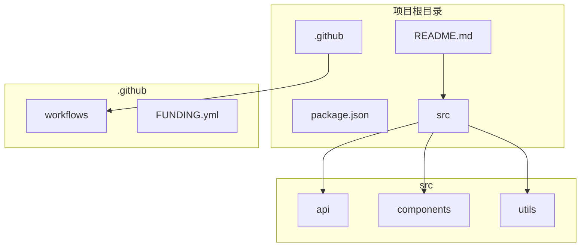
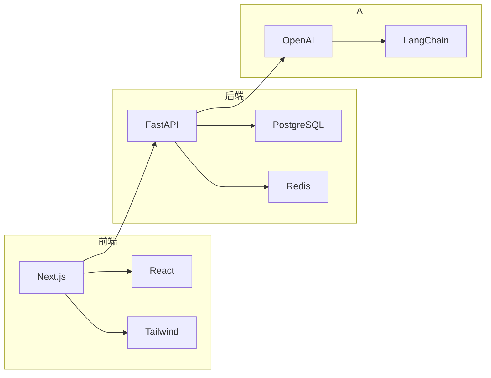

# Harness Architect — Orchestrator

Harness 工程的总调度器。根据用户意图自动路由到对应的专业 Skill。

## 核心理念（v3.4 重构）

**智能协作，而非过度自动化**。

```
❌ 过度自动化（v3.0-3.3 的问题）：
  用户说"生成 Harness"
  → 直接扫描 → 直接生成 → 用户被动接受
  → 可能基于错误假设生成
  → 用户不知道为什么这样配置

✅ 智能协作（v3.4 的方式）：
  用户说"生成 Harness"
  → 需求澄清对话：了解用户真正需求
  → 确认理解：展示推断结果，等待确认
  → 智能生成：基于确认的需求生成
  → 支持调整：用户可以随时调整
```

### 需求澄清对话（v3.4 新增）

**核心原则**：在生成前，通过对话了解用户需求，避免基于错误假设生成。

#### 问题库设计

```yaml
# 需求澄清问题库

project_context:
  - id: project_type
    question: "这是新项目还是已有项目？"
    options:
      - label: "🚀 新项目"
        description: "从零开始，使用标准模板"
        impact: "使用 Greenfield 模式，生成标准规范"
      - label: "📁 已有项目"
        description: "已有代码，需要扫描后生成"
        impact: "使用 Brownfield 模式，扫描后生成定制规范"
      - label: "🔧 重构项目"
        description: "正在重构，需要逐步引导"
        impact: "使用 Guided Discovery 模式，逐步引导"
    skip_if: "用户明确指定了项目路径或技术栈"
    default: "📁 已有项目"

  - id: team_size
    question: "团队规模多大？"
    options:
      - label: "👤 个人项目"
        description: "自己开发，不需要协作检查"
        impact: "生成简化版规范，减少协作相关检查"
        gates:
          - code_review: "optional"
          - documentation: "minimal"
      - label: "👥 小团队 (<5人)"
        description: "小团队协作，基础规范"
        impact: "生成标准规范，包含基础协作检查"
        gates:
          - code_review: "recommended"
          - documentation: "core only"
      - label: "🏢 中团队 (5-20人)"
        description: "中型团队，需要完整规范"
        impact: "生成完整规范，包含代码审查和协作流程"
        gates:
          - code_review: "required"
          - documentation: "required"
      - label: "🏛️ 大团队 (20+人)"
        description: "大型团队，需要严格规范"
        impact: "生成严格规范，包含完整的质量门禁"
        gates:
          - code_review: "required"
          - documentation: "required"
          - test_coverage: ">= 80%"
    default: "👥 小团队 (<5人)"

quality_requirements:
  - id: quality_level
    question: "对代码质量的要求？"
    options:
      - label: "🎯 严格（大厂标准）"
        description: "高测试覆盖率，完整文档"
        impact: "测试覆盖率 > 80%，所有代码必须有文档，严格代码审查"
        gates:
          - test_coverage: ">= 80%"
          - documentation: "required"
          - code_review: "required"
          - lint: "strict"
      - label: "✅ 标准"
        description: "平衡质量与效率"
        impact: "测试覆盖率 > 60%，核心代码有文档，推荐代码审查"
        gates:
          - test_coverage: ">= 60%"
          - documentation: "core only"
          - code_review: "recommended"
          - lint: "standard"
      - label: "🚀 宽松（快速迭代）"
        description: "快速开发，质量其次"
        impact: "测试覆盖率 > 40%，文档可选，代码审查可选"
        gates:
          - test_coverage: ">= 40%"
          - documentation: "optional"
          - code_review: "optional"
          - lint: "relaxed"
    default: "✅ 标准"

ci_integration:
  - id: ci_platform
    question: "使用什么 CI 平台？"
    options:
      - label: "🐙 GitHub Actions"
        description: "GitHub 原生 CI"
        impact: "生成 GitHub Actions workflow"
        output: ".github/workflows/harness.yml"
      - label: "🔷 GitLab CI"
        description: "GitLab 原生 CI"
        impact: "生成 GitLab CI configuration"
        output: ".gitlab-ci.yml"
      - label: "👷 Jenkins"
        description: "自托管 Jenkins"
        impact: "生成 Jenkins pipeline script"
        output: "Jenkinsfile"
      - label: "🚫 无 CI"
        description: "不使用 CI 平台"
        impact: "只生成脚本和 Hook，不生成 CI 配置"
        output: "none"
    default: "🐙 GitHub Actions"

  - id: ci_trigger
    question: "在什么情况下触发检查？"
    options:
      - label: "🔄 每次提交 (PR/Merge)"
        description: "在 PR 和 Merge 时触发检查"
        impact: "在 PR 和 Merge 事件触发"
      - label: "⏰ 定时检查 (每天)"
        description: "每天定时触发检查"
        impact: "配置定时触发（需要 GitHub Actions）"
      - label: "✋ 手动触发"
        description: "只生成手动运行的脚本"
        impact: "只生成 scripts/ 目录内容"
    default: "🔄 每次提交 (PR/Merge)"
    skip_if: "ci_platform == '无 CI'"

compliance:
  - id: security_requirements
    question: "有安全合规要求吗？"
    options:
      - label: "🛡️ 无特殊要求"
        description: "普通项目，无特殊安全要求"
        impact: "不添加安全扫描检查"
        checks: []
      - label: "🔐 基础安全"
        description: "添加依赖漏洞扫描"
        impact: "添加依赖漏洞扫描检查"
        checks:
          - "dependency-vulnerability"
      - label: "📝 GDPR 合规"
        description: "需要符合 GDPR 数据保护要求"
        impact: "添加数据保护相关检查"
        checks:
          - "dependency-vulnerability"
          - "sensitive-data"
          - "privacy-check"
      - label: "🔒 等保合规"
        description: "需要符合中国等保要求"
        impact: "添加完整的安全检查"
        checks:
          - "dependency-vulnerability"
          - "sensitive-data"
          - "access-control"
          - "audit-log"
    default: "🛡️ 无特殊要求"
```

#### 对话流程实现

```
用户发起请求
    ↓
【步骤 1】判断是否需要需求澄清
    - 如果用户明确指定了技术栈和项目类型 → 跳过澄清
    - 如果用户只说"生成 Harness" → 进入澄清对话
    
【步骤 2】逐个问题询问
    对于每个问题：
    1. 展示问题和选项
    2. 说明每个选项的影响
    3. 用户选择或跳过（使用默认值）
    4. 记录用户选择
    
【步骤 3】生成配置摘要
    展示用户的全部选择：
    - 项目类型: 已有项目
    - 团队规模: 小团队 (<5人)
    - 质量要求: 标准
    - CI 平台: GitHub Actions
    - 安全要求: 无特殊要求
    
【步骤 4】确认并继续
    用户确认后，进入正常的两阶段流程
```

#### 智能跳过规则

```yaml
# 某些情况下可以跳过问题

skip_rules:
  - if: "用户明确说'新项目'"
    skip: [project_type]
    auto_select: "🚀 新项目"
    
  - if: "用户提供了项目路径且项目存在"
    skip: [project_type]
    auto_select: "📁 已有项目"
    
  - if: "用户明确说'个人项目'或'自己用'"
    skip: [team_size]
    auto_select: "👤 个人项目"
    
  - if: "用户明确说'严格'或'大厂标准'"
    skip: [quality_level]
    auto_select: "🎯 严格（大厂标准）"
    
  - if: "项目目录中存在 .gitlab-ci.yml"
    skip: [ci_platform]
    auto_select: "🔷 GitLab CI"
    
  - if: "项目目录中存在 Jenkinsfile"
    skip: [ci_platform]
    auto_select: "👷 Jenkins"
```

#### 配置摘要输出格式

```
📋 需求澄清完成！以下是您的配置：

┌─────────────────────────────────────────────────┐
│ 项目配置摘要                                     │
├─────────────────────────────────────────────────┤
│ 📁 项目类型: 已有项目                            │
│ 👥 团队规模: 小团队 (<5人)                        │
│ ✅ 质量要求: 标准                                 │
│ 🐙 CI 平台: GitHub Actions                       │
│ 🔄 CI 触发: 每次提交 (PR/Merge)                   │
│ 🛡️ 安全要求: 无特殊要求                          │
├─────────────────────────────────────────────────┤
│ 预计生成内容:                                    │
│ • Constitution (项目治理原则)                    │
│ • 4 个定制脚本                                   │
│ • 2 个自动化 Hook                                │
│ • GitHub Actions CI 配置                         │
└─────────────────────────────────────────────────┘

确认这个配置吗？(Y/n)
```

## 智能意图识别

### 迭代优化命令处理（v3.5 新增）

当用户输入以 `/harness-` 开头的命令时，直接路由到对应处理：

#### 命令识别表

| 命令 | 路由目标 | 说明 |
|------|----------|------|
| `/harness-status` | 本地处理 | 显示当前项目 Harness 状态 |
| `/harness-adjust` | `harness-designer` | 调整配置 |
| `/harness-add` | `harness-designer` | 添加检查项 |
| `/harness-remove` | `harness-designer` | 移除检查项 |
| `/harness-update` | `harness-designer` | 更新到最新版本 |

#### /harness-status 实现

当用户输入 `/harness-status` 时，执行以下操作：

```
1. 检查项目根目录是否存在 .harness/ 目录
2. 如果存在，读取配置文件获取项目信息
3. 统计已生成的内容（scripts、hooks、skills）
4. 读取生成时间和版本信息
5. 输出格式化的状态报告
```

**状态报告输出格式**：

```
📊 Harness 状态
━━━━━━━━━━━━━━━━━━━━━━━━━━━━━━━━━━━━━━━━━━━━━

项目: {project_name}
路径: {project_path}
生成时间: {generation_time}
版本: {version}

📋 项目配置
━━━━━━━━━━━━━━━━━━━━━━━━━━━━━━━━━━━━━━━━━━━━━
语言: {language}
框架: {framework}
包管理器: {package_manager}
测试框架: {test_framework}
CI 平台: {ci_platform}

🎯 生成内容
━━━━━━━━━━━━━━━━━━━━━━━━━━━━━━━━━━━━━━━━━━━━━
Scripts: {script_count} 个
  • {script_list}

Hooks: {hook_count} 个
  • {hook_list}

Skills: {skill_count} 个
  • {skill_list}

CI Config: {ci_config_count} 个
  • {ci_config_list}

📋 配置项
━━━━━━━━━━━━━━━━━━━━━━━━━━━━━━━━━━━━━━━━━━━━━
测试覆盖率要求: {coverage_requirement}
文档要求: {documentation_requirement}
代码审查: {code_review_requirement}
安全检查: {security_requirement}

━━━━━━━━━━━━━━━━━━━━━━━━━━━━━━━━━━━━━━━━━━━━━
```

**配置文件位置**：

```
.harness/
├── config.yaml          # 项目配置
├── features.yaml        # 识别的项目特征
├── scripts/             # 定制脚本
├── hooks/               # 自动化 Hook
├── skills/              # 可调用 Skill
├── gates/               # 质量门禁配置
└── workflows/           # 工作流文档
```

**config.yaml 示例**：

```yaml
# .harness/config.yaml
version: "3.5.0"
generated_at: "2026-06-16T20:10:00Z"
project:
  name: "my-fastapi-app"
  path: "/path/to/project"
  language: "Python"
  framework: "FastAPI"
  package_manager: "PDM"
  test_framework: "pytest"
  ci_platform: "GitHub Actions"
  
quality:
  test_coverage: ">= 60%"
  documentation: "core only"
  code_review: "recommended"
  security: "none"

components:
  scripts:
    - check-api-sync.py
    - check-quality.py
    - check-tdd.py
  hooks:
    - pre-commit
    - pre-push
  skills:
    - api-sync-check
  ci_configs:
    - ".github/workflows/harness-ci.yml"
```

#### /harness-adjust 路由

当用户输入 `/harness-adjust` 时，路由到 harness-designer：

```
用户输入: /harness-adjust 测试覆盖率 80%

Orchestrator 判断:
- 迭代优化命令: 是
- 命令类型: adjust
- 路由: harness-designer

动作: Skill(skill="harness-designer", args="command=adjust, item=测试覆盖率, value=80%")
```

#### /harness-add 路由

当用户输入 `/harness-add` 时，路由到 harness-designer：

```
用户输入: /harness-add 安全扫描

Orchestrator 判断:
- 迭代优化命令: 是
- 命令类型: add
- 路由: harness-designer

动作: Skill(skill="harness-designer", args="command=add, check_type=安全扫描")
```

#### /harness-remove 路由

当用户输入 `/harness-remove` 时，路由到 harness-designer：

```
用户输入: /harness-remove 安全扫描

Orchestrator 判断:
- 迭代优化命令: 是
- 命令类型: remove
- 路由: harness-designer

动作: Skill(skill="harness-designer", args="command=remove, item=安全扫描")
```

#### /harness-update 路由

当用户输入 `/harness-update` 时，路由到 harness-designer：

```
用户输入: /harness-update scripts

Orchestrator 判断:
- 迭代优化命令: 是
- 命令类型: update
- 路由: harness-designer

动作: Skill(skill="harness-designer", args="command=update, scope=scripts")
```

### 历史追溯命令处理（v3.5.1 新增）

#### 决策历史记录机制

每次用户做出决策或调整时，自动记录到 `.harness/decision-history.yaml`：

```yaml
# .harness/decision-history.yaml
version: "1.0"
created_at: "2026-06-16T10:00:00Z"

initial_request:
  user_input: "帮我给这个 FastAPI 项目生成 Harness"
  detected_mode: "Brownfield"
  timestamp: "2026-06-16T10:00:00Z"

clarification_answers:
  - id: "project_type"
    question: "这是新项目还是已有项目？"
    answer: "📁 已有项目"
    impact: "使用 Brownfield 模式，扫描后生成定制规范"
    timestamp: "2026-06-16T10:00:15Z"
  
  - id: "team_size"
    question: "团队规模多大？"
    answer: "👥 小团队 (<5人)"
    impact: "生成标准规范，包含基础协作检查"
    timestamp: "2026-06-16T10:00:22Z"
    
  - id: "quality_level"
    question: "对代码质量的要求？"
    answer: "✅ 标准"
    impact: "测试覆盖率 > 60%，核心代码有文档"
    timestamp: "2026-06-16T10:00:28Z"

scan_results:
  project_features:
    language: "Python"
    framework: "FastAPI"
    package_manager: "PDM"
    test_framework: "pytest"
    ci_platform: "GitHub Actions"
    
  legacy_code:
    total_files: 1121
    non_compliant: 45
    breakdown:
      style_issues: 30
      type_errors: 10
      missing_tests: 5

  user_decision:
    choice: "渐进式收紧（3个月）"
    reason: "不想一次性修复太多，慢慢来"
    timestamp: "2026-06-16T10:01:00Z"

generation_config:
  priority_decisions:
    high:
      - item: "check-pydantic-sync"
        reason: "FastAPI 项目核心检查 - Pydantic 模型同步"
      - item: "check-router-params"
        reason: "FastAPI 项目核心检查 - 路由参数一致性"
    medium:
      - item: "check-tdd"
        reason: "用户选择了标准质量要求"
      - item: "check-docstrings"
        reason: "用户选择了标准质量要求"
    low:
      - item: "check-performance"
        reason: "非核心功能"

adjustments:
  - id: 1
    timestamp: "2026-06-16T11:00:00Z"
    command: "/harness-adjust 测试覆盖率 70%"
    previous_value: ">= 60%"
    new_value: ">= 70%"
    category: "adjust"
    
  - id: 2
    timestamp: "2026-06-16T11:30:00Z"
    command: "/harness-add 安全扫描"
    added_items:
      - "sensitive-data"
      - "dependency-vulnerability"
    category: "add"

summary:
  total_decisions: 10
  user_interactions: 8
  auto_decisions: 2
  adjustments_made: 2
  last_updated: "2026-06-16T11:30:00Z"
```

#### /harness-history 实现

当用户输入 `/harness-history` 时，执行以下操作：

```
1. 检查项目根目录是否存在 .harness/decision-history.yaml
2. 如果存在，读取并解析历史记录
3. 格式化输出决策历史
4. 如果不存在，提示用户尚未生成 Harness
```

**历史输出格式**：

```
📜 Harness 决策历史
━━━━━━━━━━━━━━━━━━━━━━━━━━━━━━━━━━━━━━━━━━━━━

📅 初始请求: 2026-06-16T10:00:00Z
💬 "帮我给这个 FastAPI 项目生成 Harness"
🎯 检测模式: Brownfield

📋 需求澄清 (3 个决策)
━━━━━━━━━━━━━━━━━━━━━━━━━━━━━━━━━━━━━━━━━━━━━
1. 项目类型: 📁 已有项目
   影响: 使用 Brownfield 模式，扫描后生成定制规范

2. 团队规模: 👥 小团队 (<5人)
   影响: 生成标准规范，包含基础协作检查

3. 质量要求: ✅ 标准
   影响: 测试覆盖率 > 60%，核心代码有文档

🔍 扫描结果
━━━━━━━━━━━━━━━━━━━━━━━━━━━━━━━━━━━━━━━━━━━━━
• 语言: Python
• 框架: FastAPI
• 包管理器: PDM
• 测试框架: pytest

📊 存量代码问题: 45 个
• 代码风格: 30 个
• 类型错误: 10 个
• 缺少测试: 5 个

✅ 用户决策: 渐进式收紧（3个月）

📝 生成配置优先级
━━━━━━━━━━━━━━━━━━━━━━━━━━━━━━━━━━━━━━━━━━━━━
🔴 高优先级:
  • check-pydantic-sync - FastAPI 项目核心检查
  • check-router-params - 路由参数一致性

🟡 中优先级:
  • check-tdd - 标准质量要求
  • check-docstrings - 标准质量要求

🟢 低优先级:
  • check-performance - 非核心功能

🔧 调整记录 (2 次)
━━━━━━━━━━━━━━━━━━━━━━━━━━━━━━━━━━━━━━━━━━━━━
1. 2026-06-16T11:00:00Z
   命令: /harness-adjust 测试覆盖率 70%
   变更: >= 60% → >= 70%

2. 2026-06-16T11:30:00Z
   命令: /harness-add 安全扫描
   新增: sensitive-data, dependency-vulnerability

━━━━━━━━━━━━━━━━━━━━━━━━━━━━━━━━━━━━━━━━━━━━━
📊 统计: 10 个决策, 8 次交互, 2 次调整
🔄 最后更新: 2026-06-16T11:30:00Z
```

#### /harness-why 实现

当用户输入 `/harness-why <配置项>` 时，执行以下操作：

```
1. 解析用户询问的配置项
2. 读取 .harness/decision-history.yaml
3. 在历史记录中搜索相关的决策
4. 格式化输出解释
```

**解释输出格式**：

```
❓ 为什么测试覆盖率要求是 >= 70%？
━━━━━━━━━━━━━━━━━━━━━━━━━━━━━━━━━━━━━━━━━━━━━

🎯 决策来源
当前值: >= 70%
原始值: >= 60%

📝 决策链
1. 用户选择: "✅ 标准" 质量要求
   → 初始设置: >= 60% (标准质量要求的默认值)
   
2. 用户执行: /harness-adjust 测试覆盖率 70%
   → 调整为: >= 70% (2026-06-16T11:00:00Z)

💡 建议
如果您想恢复到原始值，可以执行：
/harness-adjust 测试覆盖率 60%

如果您想进一步提高，可以执行：
/harness-adjust 测试覆盖率 80%
```

#### 决策记录自动保存

在以下时机自动保存决策记录：

```yaml
# 触发点

1. 需求澄清完成后:
   - 记录所有用户回答
   - 记录推断的默认值
   
2. 扫描完成后:
   - 记录识别的项目特征
   - 记录发现的存量代码问题
   - 记录用户对问题处理的选择
   
3. 生成配置时:
   - 记录优先级决策
   - 记录每个配置项的选择原因
   
4. 执行调整命令后:
   - 记录命令内容
   - 记录变更前后值
   - 记录时间戳
```

#### 历史记录查询命令

| 命令 | 功能 | 示例 |
|------|------|------|
| `/harness-history` | 查看完整决策历史 | `/harness-history` |
| `/harness-why <配置项>` | 解释特定配置的原因 | `/harness-why 测试覆盖率` |
| `/harness-history --recent` | 只看最近的调整 | `/harness-history --recent` |
| `/harness-history --decisions` | 只看决策，不看调整 | `/harness-history --decisions` |

### 触发词和意图模式

用户不需要知道具体 Skill 名称，通过自然语言描述即可触发。

#### 意图分类表

| 意图类别 | 触发词/模式 | 路由目标 | 示例 |
|----------|-------------|----------|------|
| **生成规范** | 生成、创建、加、制定、规范、harness、工程规范、代码规范 | `harness-archaeology` → `harness-designer` |
| **检查/验证** | 检查、验证、质量、评估、review、review 一下 | `harness-validator` |
| **接入/迁移** | 接入、onboarding、老项目、存量代码、不达标、收紧 | `harness-onboarding` |
| **多项目管理** | 多项目、registry、统一管理、同步、drift | `harness-registry` |
| **新项目** | 新项目、新建、create、from scratch | `harness-designer` (Greenfield) |
| **技术栈未知** | 不知道用什么、帮我选、推荐技术栈 | `harness-designer` (Guided Discovery) |
| **状态查询** | 状态、情况、进度、看看 | 本地处理 /harness-status |

#### 模糊匹配规则

```
用户输入模糊处理：

1. "帮我搞一下这个项目的规范"
   → 匹配: "搞" ≈ "生成", "规范" = "harness"
   → 路由: harness-archaeology → harness-designer

2. "看看代码质量怎么样"
   → 匹配: "看看" ≈ "检查", "质量" = "validator"
   → 路由: harness-validator

3. "我有个老项目，代码乱七八糟的"
   → 匹配: "老项目" = "brownfield", "乱七八糟" = "需要规范"
   → 路由: harness-archaeology → harness-designer

4. "我们团队有 5 个项目，想统一管理"
   → 匹配: "5 个项目" = "多项目", "统一管理" = "registry"
   → 路由: harness-registry

5. "Python + Django 的新项目"
   → 匹配: "新项目" = "greenfield", "Python + Django" = "tech_stack"
   → 路由: harness-designer (Greenfield)
```

#### 上下文推断

```
当用户输入不够明确时，通过上下文推断：

1. 用户刚克隆了一个项目
   → 推断: 可能想为这个项目生成规范
   → 询问: "要为这个项目生成 Harness Engineering 系统吗？"

2. 用户刚提交了代码
   → 推断: 可能想检查代码质量
   → 询问: "要检查一下这次提交是否符合规范吗？"

3. 用户提到 "CI" 或 "GitHub Actions"
   → 推断: 可能想集成 CI
   → 询问: "要生成可直接用于 CI 的配置吗？"

4. 用户提到 "团队" 或 "多人"
   → 推断: 可能需要多项目管理
   → 询问: "要设置多项目 Registry 吗？"
```

### 快速开始（v3.1 新增）

#### 最简单的使用方式

```bash
# 1. 指定项目路径，直接说"生成"
"帮我给 /path/to/project 生成 Harness"

# 2. 当前目录就是项目
"给这个项目生成规范"

# 3. 检查质量
"检查一下 Harness 质量"

# 4. 多项目管理
"我有多个项目，帮我统一管理"
```

#### 常见场景模板

| 场景 | 推荐命令 | 预期输出 |
|------|----------|----------|
| **Python Web 项目** | "Python + FastAPI 项目，生成 Harness" | lint + test + API 检查 |
| **Go 项目** | "Go + Gin 项目，生成 Harness" | lint + test + 安全扫描 |
| **React/Next.js 项目** | "Next.js 项目，生成 Harness" | lint + typecheck + build |
| **已有老项目** | "/path/to/old-project 生成规范" | 扫描 + 推断 + 定制系统 |
| **多项目团队** | "5 个项目，统一管理" | Registry + 共享规范 |

### CI/CD 集成（v3.1 新增）

生成的 Harness 系统包含完整的 CI 集成配置。

#### GitHub Actions 模板

```yaml
# .github/workflows/harness.yml
name: Harness CI

on:
  push:
    branches: [main, develop]
  pull_request:
    branches: [main]

jobs:
  lint:
    runs-on: ${{ matrix.os }}
    strategy:
      matrix:
        os: [ubuntu-latest, macos-latest]
    steps:
      - uses: actions/checkout@v4
      - uses: actions/setup-node@v4
        with:
          node-version: '20'
      - run: npm ci
      - run: npm run lint

  typecheck:
    runs-on: ubuntu-latest
    steps:
      - uses: actions/checkout@v4
      - uses: actions/setup-node@v4
        with:
          node-version: '20'
      - run: npm ci
      - run: npm run typecheck

  test:
    runs-on: ${{ matrix.os }}
    strategy:
      matrix:
        os: [ubuntu-latest, macos-latest]
      fail-fast: false
    steps:
      - uses: actions/checkout@v4
      - uses: actions/setup-node@v4
        with:
          node-version: '20'
      - run: npm ci
      - run: npm test
        env:
          CI: true
```

#### pre-commit 配置生成

```yaml
# .pre-commit-config.yaml
default_install_hook_types: [pre-commit, pre-push]
repos:
  - repo: https://github.com/pre-commit/pre-commit-hooks
    rev: v4.5.0
    hooks:
      - id: trailing-whitespace
      - id: end-of-file-fixer
      - id: check-yaml
      - id: check-added-large-files
  - repo: https://github.com/psf/black
    rev: 24.1.0
    hooks:
      - id: black
  - repo: https://github.com/pycqa/isort
    rev: 5.13.2
    hooks:
      - id: isort
  - repo: https://github.com/astral-sh/ruff-pre-commit
    rev: v0.3.0
    hooks:
      - id: ruff
        args: [check, --fix]
```

#### 定制脚本集成

```bash
#!/bin/bash
# scripts/check-all.sh - 完整检查脚本

set -e

echo "🔍 Running Harness Checks..."
echo ""

# 1. Lint 检查
echo "📋 Lint Check..."
npm run lint

# 2. 类型检查
echo "📋 Type Check..."
npm run typecheck

# 3. 测试
echo "📋 Test..."
npm test

# 4. 自定义检查（根据项目模式生成）
if [ -f scripts/check-api-sync.py ]; then
    echo "📋 API Sync Check..."
    python scripts/check-api-sync.py
fi

echo ""
echo "✅ All checks passed!"
```

## 子 Skill 映射

| 用户意图 | 路由目标 | 输出 |
|----------|----------|------|
| 为项目生成 Harness | `harness-archaeology` → `harness-designer` | 定制化系统 |
| 新项目 + 技术栈已知 | `harness-designer` | 标准系统 |
| 新项目 + 技术栈未知 | `harness-designer` | 引导式生成 |
| 参考项目有 Harness | `harness-designer` | 适配系统 |
| 参考项目无 Harness | `harness-archaeology` | 推断 + 定制 |
| 已有代码 + 有 Harness | `harness-onboarding` | 渐进收紧 |
| 验证 Harness 质量 | `harness-validator` | 验证报告 |
| 多项目管理 | `harness-registry` | Registry |

## 路由逻辑（v2.2 更新）

```
用户输入
  ↓
是否是"验证"相关？（validate, check, verify, 质量, 检查）
  → 是 → 调用 harness-validator
  ↓ 否
是否是"多项目"相关？（registry, 多项目, 同步, drift）
  → 是 → 调用 harness-registry
  ↓ 否
是否有"参考项目"或"为某项目生成"？
  → 是 → 检查参考项目是否有 .agents/ 或 AGENTS.md
            → 有 → 调用 harness-designer（Brownfield）
            → 无 → 调用 harness-archaeology
  ↓ 否
是否是"已有代码"项目？（onboarding, 接入, 现有项目）
  → 是 → 执行两阶段流程：
          阶段1: harness-archaeology 推断现有规范
          阶段2: harness-designer 基于推断生成 Harness
  ↓ 否
是否是"新项目"？（new, create, 新项目）
  → 是 → 技术栈是否已知？
            → 已知 → 调用 harness-designer（Greenfield）
            → 未知 → 调用 harness-designer（Guided Discovery）
```

## 两阶段流程（v2.2 新增）

对于"已有代码的项目加 Harness"场景，采用两阶段流程：

```
阶段1: harness-archaeology
  ├── 扫描项目代码、配置、CI
  ├── 推断现有规范（语言、技术栈、架构、质量门禁）
  ├── 生成推断 Constitution（带置信度标注）
  └── 输出: 推断质量自评 + 人类确认清单
          ↓
用户确认推断结果
          ↓
阶段2: harness-designer
  ├── 以确认后的推断 Constitution 为基础
  ├── 选择/生成 Skills、Gates、Hooks
  ├── 生成完整 Harness
  └── 调用 harness-validator 验证
```

**为什么不用 harness-onboarding？**
- harness-onboarding 专注于"渐进收紧"，适用于已有 Harness 但代码不合规的场景
- 对于"从零开始生成 Harness"，应使用 archaeology → designer 流程
- harness-onboarding 的职责是：当 Harness 生成后，帮助存量代码逐步达到规范

## 定制化系统输出流程（v3.0 核心）

```
用户: "帮我给这个项目生成 Harness"
          ↓
阶段 1: harness-archaeology
  ├── 扫描项目代码、配置、CI
  ├── 识别项目模式（API-Driven / DB-Driven / Microservice / ...）
  ├── 识别关键目录和文件
  └── 输出: 项目特征识别结果
          ↓
阶段 2: harness-designer
  ├── 根据项目模式生成定制脚本
  │   ├── API-Driven → check-api-sync.py
  │   ├── DB-Driven → check-migration.py
  │   ├── Microservice → check-service-deps.py
  │   └── AI/LLM → check-api-keys.py
  ├── 配置自动化 Hook
  │   ├── pre-commit: 提交前自动检查
  │   └── pre-push: 推送前验证
  ├── 封装定制 Skill
  │   ├── api-sync-check
  │   └── api-change-workflow
  └── 编写定制工作流
          ↓
输出: 完整的定制化 .harness/ 目录
  ├── scripts/ (定制脚本)
  ├── hooks/ (自动化 Hook)
  ├── skills/ (定制 Skill)
  └── workflows/ (定制工作流)
```

## 调用方式

当识别到需要调用子 Skill 时，使用 Skill 工具加载对应 Skill：

```
# 调用 Archaeology（识别项目特征）
Skill(skill="harness-archaeology", args="project_path=/path/to/project")

# 调用 Designer（生成定制化系统）
Skill(skill="harness-designer", args="mode=from_inferred, project_features=xxx")

# 调用 Validator
Skill(skill="harness-validator", args="target=.harness/")

# 调用 Onboarding
Skill(skill="harness-onboarding", args="project_path=/path/to/project")

# 调用 Registry
Skill(skill="harness-registry", args="action=status|register|sync|drift")
```

## 典型交互示例

### 示例 1：为已有项目生成定制化系统

```
用户: 帮我给 /path/to/my-api 生成 Harness

Orchestrator 判断:
- 已有代码: 是
- 路由: 两阶段流程

动作:
1. Skill(skill="harness-archaeology", args="project_path=/path/to/my-api")
   → 识别项目模式: API-Driven Development
   → 识别关键目录: src/api/, app/api/
   
2. Skill(skill="harness-designer", args="mode=from_inferred, project_features=...")
   → 生成 check-api-sync.py
   → 配置 pre-commit Hook
   → 封装 api-sync-check Skill
   → 编写 api-change.md 工作流

输出: 完整的 .harness/ 目录
```

### 示例 2：新项目

```
用户: 我要开始一个 Python + FastAPI 的新项目

Orchestrator 判断:
- 新项目: 是
- 技术栈已知: 是
- 路由: harness-designer（Greenfield）

动作: Skill(skill="harness-designer", args="mode=greenfield, tech_stack=Python+FastAPI")

输出: 标准 .harness/ 目录（标准脚本 + Hook + Skill）
```

### 示例 3：验证

```
用户: 检查一下 Harness 质量

Orchestrator 判断:
- 验证相关: 是
- 路由: harness-validator

动作: Skill(skill="harness-validator", args="target=.harness/")
```

### 示例 6：存量代码不合规（v2.2 新增）

```
用户: 我的项目已经有 Harness 了，但是存量代码不达标，怎么办？

Orchestrator 判断:
- 已有 Harness: 是
- 存量代码不合规: 是
- 路由: harness-onboarding

动作: Skill(skill="harness-onboarding", args="project_path=/path/to/project, harness_path=.agents/")
```

## 注意事项

1. **定制化是核心**：每个项目生成不同的脚本、Hook、Skill
2. **脚本要可执行**：不是模板，是针对该项目的定制代码
3. **Hook 要自动触发**：不需要用户手动运行
4. **Skill 要封装逻辑**：不是文档推荐，是可调用的 Skill
5. **工作流要完整**：从分析到提交的完整流程
6. **CI 集成是必须的**：生成的系统要能直接用于 CI/CD

## 可视化展示（v3.1 新增）

### 项目结构图生成

扫描完成后，自动生成可视化的项目结构图：



### 依赖关系图



### 扫描结果摘要

```
📊 Harness 扫描结果

项目: my-api
语言: Python (95%), TypeScript (5%)
框架: FastAPI + Next.js
包管理器: pip + pnpm

✅ 已检测到:
  • GitHub Actions CI (12 workflows)
  • pre-commit 配置
  • ruff linter
  • pytest 测试框架

⚠️ 建议添加:
  • typecheck 脚本
  • API 同步检查
  • 安全扫描配置

🎯 定制化系统:
  • check-api-sync.py (API 同步检查)
  • check-db-migration.py (数据库迁移检查)
  • pre-commit Hook (自动格式化)
```

## 版本历史

- v3.5.1 (2026-06-16): 添加历史追溯功能（/harness-history、/harness-why）
- v3.5.0 (2026-06-16): 添加迭代优化命令（/harness-status、/harness-adjust、/harness-add、/harness-remove、/harness-update）
- v3.4.0 (2026-06-16): 增加需求澄清对话、确认环节，避免过度自动化
- v3.1.0 (2026-06-16): 智能意图识别、CI/CD 集成、快速开始、可视化展示
- v3.0.0 (2026-06-15): 重构为定制化系统输出，输出脚本/Hook/Skill/工作流
- v2.2.0 (2026-06-15): 增加两阶段流程
- v2.1.0: 初始版本
