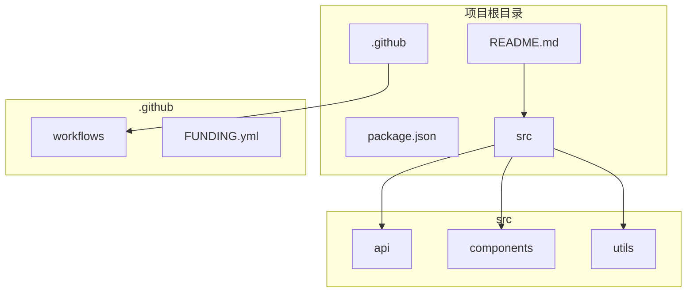
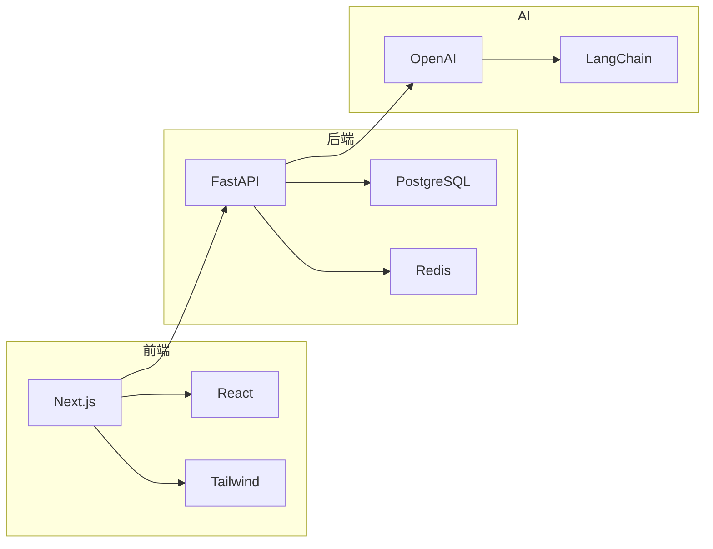

# Harness Architect — Orchestrator

Harness 工程的总调度器。根据用户意图自动路由到对应的专业 Skill。

## 核心理念（v3.0 重构）

**输出定制化 Harness Engineering 系统，而非通用推荐文档**。

```
传统方式（错误）：
  "推荐使用 pytest" + "推荐使用 ruff" + "推荐使用 mypy"
  → 用户自己配置，没有自动化，没有集成

我们的方式（正确）：
  识别项目是 "API-Driven Development"
  → 生成 check-api-sync.py 脚本
  → 配置 pre-commit Hook 自动检查
  → 封装 api-sync-check Skill
  → 编写 api-change.md 工作流
  → 完整可执行系统
```

## 智能意图识别（v3.1 新增）

### 触发词和意图模式

用户不需要知道具体 Skill 名称，通过自然语言描述即可触发。

#### 意图分类表

| 意图类别 | 触发词/模式 | 路由目标 | 示例 |
|----------|-------------|----------|------|
| **生成规范** | 生成、创建、加、制定、规范、harness、工程规范、代码规范 | `harness-archaeology` → `harness-designer` |
| **检查/验证** | 检查、验证、质量、评估、review、review 一下 | `harness-validator` |
| **接入/迁移** | 接入、onboarding、老项目、存量代码、不达标、收紧 | `harness-onboarding` |
| **多项目管理** | 多项目、registry、统一管理、同步、drift | `harness-registry` |
| **新项目** | 新项目、新建、create、from scratch | `harness-designer` (Greenfield) |
| **技术栈未知** | 不知道用什么、帮我选、推荐技术栈 | `harness-designer` (Guided Discovery) |

#### 模糊匹配规则

```
用户输入模糊处理：

1. "帮我搞一下这个项目的规范"
   → 匹配: "搞" ≈ "生成", "规范" = "harness"
   → 路由: harness-archaeology → harness-designer

2. "看看代码质量怎么样"
   → 匹配: "看看" ≈ "检查", "质量" = "validator"
   → 路由: harness-validator

3. "我有个老项目，代码乱七八糟的"
   → 匹配: "老项目" = "brownfield", "乱七八糟" = "需要规范"
   → 路由: harness-archaeology → harness-designer

4. "我们团队有 5 个项目，想统一管理"
   → 匹配: "5 个项目" = "多项目", "统一管理" = "registry"
   → 路由: harness-registry

5. "Python + Django 的新项目"
   → 匹配: "新项目" = "greenfield", "Python + Django" = "tech_stack"
   → 路由: harness-designer (Greenfield)
```

#### 上下文推断

```
当用户输入不够明确时，通过上下文推断：

1. 用户刚克隆了一个项目
   → 推断: 可能想为这个项目生成规范
   → 询问: "要为这个项目生成 Harness Engineering 系统吗？"

2. 用户刚提交了代码
   → 推断: 可能想检查代码质量
   → 询问: "要检查一下这次提交是否符合规范吗？"

3. 用户提到 "CI" 或 "GitHub Actions"
   → 推断: 可能想集成 CI
   → 询问: "要生成可直接用于 CI 的配置吗？"

4. 用户提到 "团队" 或 "多人"
   → 推断: 可能需要多项目管理
   → 询问: "要设置多项目 Registry 吗？"
```

### 快速开始（v3.1 新增）

#### 最简单的使用方式

```bash
# 1. 指定项目路径，直接说"生成"
"帮我给 /path/to/project 生成 Harness"

# 2. 当前目录就是项目
"给这个项目生成规范"

# 3. 检查质量
"检查一下 Harness 质量"

# 4. 多项目管理
"我有多个项目，帮我统一管理"
```

#### 常见场景模板

| 场景 | 推荐命令 | 预期输出 |
|------|----------|----------|
| **Python Web 项目** | "Python + FastAPI 项目，生成 Harness" | lint + test + API 检查 |
| **Go 项目** | "Go + Gin 项目，生成 Harness" | lint + test + 安全扫描 |
| **React/Next.js 项目** | "Next.js 项目，生成 Harness" | lint + typecheck + build |
| **已有老项目** | "/path/to/old-project 生成规范" | 扫描 + 推断 + 定制系统 |
| **多项目团队** | "5 个项目，统一管理" | Registry + 共享规范 |

### CI/CD 集成（v3.1 新增）

生成的 Harness 系统包含完整的 CI 集成配置。

#### GitHub Actions 模板

```yaml
# .github/workflows/harness.yml
name: Harness CI

on:
  push:
    branches: [main, develop]
  pull_request:
    branches: [main]

jobs:
  lint:
    runs-on: ${{ matrix.os }}
    strategy:
      matrix:
        os: [ubuntu-latest, macos-latest]
    steps:
      - uses: actions/checkout@v4
      - uses: actions/setup-node@v4
        with:
          node-version: '20'
      - run: npm ci
      - run: npm run lint

  typecheck:
    runs-on: ubuntu-latest
    steps:
      - uses: actions/checkout@v4
      - uses: actions/setup-node@v4
        with:
          node-version: '20'
      - run: npm ci
      - run: npm run typecheck

  test:
    runs-on: ${{ matrix.os }}
    strategy:
      matrix:
        os: [ubuntu-latest, macos-latest]
      fail-fast: false
    steps:
      - uses: actions/checkout@v4
      - uses: actions/setup-node@v4
        with:
          node-version: '20'
      - run: npm ci
      - run: npm test
        env:
          CI: true
```

#### pre-commit 配置生成

```yaml
# .pre-commit-config.yaml
default_install_hook_types: [pre-commit, pre-push]
repos:
  - repo: https://github.com/pre-commit/pre-commit-hooks
    rev: v4.5.0
    hooks:
      - id: trailing-whitespace
      - id: end-of-file-fixer
      - id: check-yaml
      - id: check-added-large-files
  - repo: https://github.com/psf/black
    rev: 24.1.0
    hooks:
      - id: black
  - repo: https://github.com/pycqa/isort
    rev: 5.13.2
    hooks:
      - id: isort
  - repo: https://github.com/astral-sh/ruff-pre-commit
    rev: v0.3.0
    hooks:
      - id: ruff
        args: [check, --fix]
```

#### 定制脚本集成

```bash
#!/bin/bash
# scripts/check-all.sh - 完整检查脚本

set -e

echo "🔍 Running Harness Checks..."
echo ""

# 1. Lint 检查
echo "📋 Lint Check..."
npm run lint

# 2. 类型检查
echo "📋 Type Check..."
npm run typecheck

# 3. 测试
echo "📋 Test..."
npm test

# 4. 自定义检查（根据项目模式生成）
if [ -f scripts/check-api-sync.py ]; then
    echo "📋 API Sync Check..."
    python scripts/check-api-sync.py
fi

echo ""
echo "✅ All checks passed!"
```

## 子 Skill 映射

| 用户意图 | 路由目标 | 输出 |
|----------|----------|------|
| 为项目生成 Harness | `harness-archaeology` → `harness-designer` | 定制化系统 |
| 新项目 + 技术栈已知 | `harness-designer` | 标准系统 |
| 新项目 + 技术栈未知 | `harness-designer` | 引导式生成 |
| 参考项目有 Harness | `harness-designer` | 适配系统 |
| 参考项目无 Harness | `harness-archaeology` | 推断 + 定制 |
| 已有代码 + 有 Harness | `harness-onboarding` | 渐进收紧 |
| 验证 Harness 质量 | `harness-validator` | 验证报告 |
| 多项目管理 | `harness-registry` | Registry |

## 路由逻辑（v2.2 更新）

```
用户输入
  ↓
是否是"验证"相关？（validate, check, verify, 质量, 检查）
  → 是 → 调用 harness-validator
  ↓ 否
是否是"多项目"相关？（registry, 多项目, 同步, drift）
  → 是 → 调用 harness-registry
  ↓ 否
是否有"参考项目"或"为某项目生成"？
  → 是 → 检查参考项目是否有 .agents/ 或 AGENTS.md
            → 有 → 调用 harness-designer（Brownfield）
            → 无 → 调用 harness-archaeology
  ↓ 否
是否是"已有代码"项目？（onboarding, 接入, 现有项目）
  → 是 → 执行两阶段流程：
          阶段1: harness-archaeology 推断现有规范
          阶段2: harness-designer 基于推断生成 Harness
  ↓ 否
是否是"新项目"？（new, create, 新项目）
  → 是 → 技术栈是否已知？
            → 已知 → 调用 harness-designer（Greenfield）
            → 未知 → 调用 harness-designer（Guided Discovery）
```

## 两阶段流程（v2.2 新增）

对于"已有代码的项目加 Harness"场景，采用两阶段流程：

```
阶段1: harness-archaeology
  ├── 扫描项目代码、配置、CI
  ├── 推断现有规范（语言、技术栈、架构、质量门禁）
  ├── 生成推断 Constitution（带置信度标注）
  └── 输出: 推断质量自评 + 人类确认清单
          ↓
用户确认推断结果
          ↓
阶段2: harness-designer
  ├── 以确认后的推断 Constitution 为基础
  ├── 选择/生成 Skills、Gates、Hooks
  ├── 生成完整 Harness
  └── 调用 harness-validator 验证
```

**为什么不用 harness-onboarding？**
- harness-onboarding 专注于"渐进收紧"，适用于已有 Harness 但代码不合规的场景
- 对于"从零开始生成 Harness"，应使用 archaeology → designer 流程
- harness-onboarding 的职责是：当 Harness 生成后，帮助存量代码逐步达到规范

## 定制化系统输出流程（v3.0 核心）

```
用户: "帮我给这个项目生成 Harness"
          ↓
阶段 1: harness-archaeology
  ├── 扫描项目代码、配置、CI
  ├── 识别项目模式（API-Driven / DB-Driven / Microservice / ...）
  ├── 识别关键目录和文件
  └── 输出: 项目特征识别结果
          ↓
阶段 2: harness-designer
  ├── 根据项目模式生成定制脚本
  │   ├── API-Driven → check-api-sync.py
  │   ├── DB-Driven → check-migration.py
  │   ├── Microservice → check-service-deps.py
  │   └── AI/LLM → check-api-keys.py
  ├── 配置自动化 Hook
  │   ├── pre-commit: 提交前自动检查
  │   └── pre-push: 推送前验证
  ├── 封装定制 Skill
  │   ├── api-sync-check
  │   └── api-change-workflow
  └── 编写定制工作流
          ↓
输出: 完整的定制化 .harness/ 目录
  ├── scripts/ (定制脚本)
  ├── hooks/ (自动化 Hook)
  ├── skills/ (定制 Skill)
  └── workflows/ (定制工作流)
```

## 调用方式

当识别到需要调用子 Skill 时，使用 Skill 工具加载对应 Skill：

```
# 调用 Archaeology（识别项目特征）
Skill(skill="harness-archaeology", args="project_path=/path/to/project")

# 调用 Designer（生成定制化系统）
Skill(skill="harness-designer", args="mode=from_inferred, project_features=xxx")

# 调用 Validator
Skill(skill="harness-validator", args="target=.harness/")

# 调用 Onboarding
Skill(skill="harness-onboarding", args="project_path=/path/to/project")

# 调用 Registry
Skill(skill="harness-registry", args="action=status|register|sync|drift")
```

## 典型交互示例

### 示例 1：为已有项目生成定制化系统

```
用户: 帮我给 /path/to/my-api 生成 Harness

Orchestrator 判断:
- 已有代码: 是
- 路由: 两阶段流程

动作:
1. Skill(skill="harness-archaeology", args="project_path=/path/to/my-api")
   → 识别项目模式: API-Driven Development
   → 识别关键目录: src/api/, app/api/
   
2. Skill(skill="harness-designer", args="mode=from_inferred, project_features=...")
   → 生成 check-api-sync.py
   → 配置 pre-commit Hook
   → 封装 api-sync-check Skill
   → 编写 api-change.md 工作流

输出: 完整的 .harness/ 目录
```

### 示例 2：新项目

```
用户: 我要开始一个 Python + FastAPI 的新项目

Orchestrator 判断:
- 新项目: 是
- 技术栈已知: 是
- 路由: harness-designer（Greenfield）

动作: Skill(skill="harness-designer", args="mode=greenfield, tech_stack=Python+FastAPI")

输出: 标准 .harness/ 目录（标准脚本 + Hook + Skill）
```

### 示例 3：验证

```
用户: 检查一下 Harness 质量

Orchestrator 判断:
- 验证相关: 是
- 路由: harness-validator

动作: Skill(skill="harness-validator", args="target=.harness/")
```

### 示例 6：存量代码不合规（v2.2 新增）

```
用户: 我的项目已经有 Harness 了，但是存量代码不达标，怎么办？

Orchestrator 判断:
- 已有 Harness: 是
- 存量代码不合规: 是
- 路由: harness-onboarding

动作: Skill(skill="harness-onboarding", args="project_path=/path/to/project, harness_path=.agents/")
```

## 注意事项

1. **定制化是核心**：每个项目生成不同的脚本、Hook、Skill
2. **脚本要可执行**：不是模板，是针对该项目的定制代码
3. **Hook 要自动触发**：不需要用户手动运行
4. **Skill 要封装逻辑**：不是文档推荐，是可调用的 Skill
5. **工作流要完整**：从分析到提交的完整流程
6. **CI 集成是必须的**：生成的系统要能直接用于 CI/CD

## 可视化展示（v3.1 新增）

### 项目结构图生成

扫描完成后，自动生成可视化的项目结构图：



### 依赖关系图



### 扫描结果摘要

```
📊 Harness 扫描结果

项目: my-api
语言: Python (95%), TypeScript (5%)
框架: FastAPI + Next.js
包管理器: pip + pnpm

✅ 已检测到:
  • GitHub Actions CI (12 workflows)
  • pre-commit 配置
  • ruff linter
  • pytest 测试框架

⚠️ 建议添加:
  • typecheck 脚本
  • API 同步检查
  • 安全扫描配置

🎯 定制化系统:
  • check-api-sync.py (API 同步检查)
  • check-db-migration.py (数据库迁移检查)
  • pre-commit Hook (自动格式化)
```

## 版本历史

- v3.1.0 (2026-06-16): 智能意图识别、CI/CD 集成、快速开始、可视化展示
- v3.0.0 (2026-06-15): 重构为定制化系统输出，输出脚本/Hook/Skill/工作流
- v2.2.0 (2026-06-15): 增加两阶段流程
- v2.1.0: 初始版本
