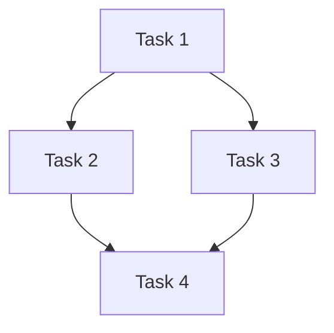
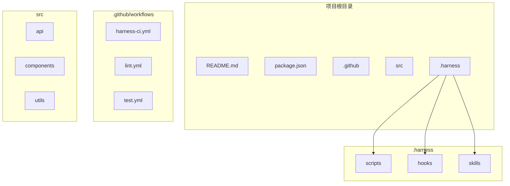

# Harness Designer

生成和修改定制化 Harness Engineering 系统。

## 触发条件

- 接收 harness-archaeology 的项目特征识别结果
- 基于项目模式生成定制化系统
- 将考古结果转化为可执行的脚本、Hook、Skill、工作流

## 核心职责（v3.2 重构 - 融合 SDD 最佳实践）

```
输入: harness-archaeology 的项目特征识别结果
输出: 完整的定制化 Harness Engineering 系统

转换过程:
  项目特征 → 识别模式 → 生成 Constitution → 生成 Specs → 生成 Tasks 
           → 生成脚本 → 配置 Hook → 封装 Skill → 编写工作流
```

### 借鉴 SDD 工具的最佳实践

| 来源 | 最佳实践 | 应用到 Harness |
|------|----------|---------------|
| **Spec Kit** | Constitution 定义项目治理原则 | 生成项目级 Constitution |
| **Spec Kit** | Specs 聚焦 what 和 why | 生成功能规格文档 |
| **Spec Kit** | Tasks 从 Plan 拆解 | 生成可执行任务列表 |
| **OpenSpec** | AGENTS.md 作为 AI 指南 | 生成 AI 协作指南 |
| **OpenSpec** | 变更追踪 (proposal → archive) | 生成变更管理流程 |
| **Superpowers** | TDD 强制验证 | 生成 TDD 检查脚本 |
| **Superpowers** | 内联自审 (Inline Self-Review) | 生成代码审查检查清单 |
| **Superpowers** | 7 阶段工作流 | 生成完整开发流程 |

### Constitution 生成规则（借鉴 Spec Kit）

Constitution 定义项目的治理原则和开发指南：

```markdown
# Constitution - 项目治理原则

## 1. 代码质量标准
- 所有代码必须通过 lint 检查
- 所有代码必须通过类型检查
- 代码覆盖率要求: {coverage_requirement}%

## 2. 测试标准
- 遵循 TDD: 先写测试，再写实现
- 每个公开函数必须有测试
- 测试命名: test_<function>_<scenario>_<expected>

## 3. 文档标准
- 公开 API 必须有 docstring
- 复杂逻辑必须有注释
- README 必须包含安装和使用说明

## 4. 提交标准
- 遵循 Conventional Commits
- 格式: <type>(<scope>): <subject>
- PR 必须关联 Issue 或 Spec

## 5. 安全标准
- 禁止硬编码敏感信息
- 所有输入必须验证
- 定期更新依赖
```

### Specs 生成规则（借鉴 OpenSpec）

Specs 聚焦于 what 和 why，不涉及 how：

```markdown
# Spec: [功能名称]

## 概述
[功能的简要描述]

## 需求

### Requirement: [需求名称]
[需求的详细描述]

#### Scenario: [场景名称]
**GIVEN** [前置条件]
**WHEN** [触发条件]
**THEN** [预期结果]

## 验收标准
- [ ] [标准 1]
- [ ] [标准 2]
```

### Tasks 生成规则（借鉴 Spec Kit）

从 Specs 拆解出可执行任务：

```markdown
# Tasks - [功能名称]

## 任务列表

### Task 1: [任务名称]
- **类型**: setup | test | implement | review
- **预估**: [时间]
- **依赖**: [前置任务]
- **描述**: [任务描述]
- **验收**: [完成标准]

### Task 2: [任务名称]
...

## 依赖关系图



## 执行顺序
1. Task 1 (无依赖)
2. Task 2 / Task 3 (可并行)
3. Task 4 (依赖 T2, T3)
```

### TDD 检查脚本（借鉴 Superpowers）

生成 TDD 验证脚本：

```python
#!/usr/bin/env python3
"""
TDD 验证脚本
确保测试先于实现编写
"""
import os
import subprocess
from pathlib import Path
from datetime import datetime

class TDDValidator:
    def __init__(self, project_root: str = "."):
        self.root = Path(project_root)
        self.git_log = self._get_git_log()
    
    def _get_git_log(self, limit: int = 20):
        """获取最近的 git 提交"""
        result = subprocess.run(
            ["git", "log", f"-{limit}", "--format=%H|%s|%ad", "--date=short"],
            capture_output=True, text=True, cwd=self.root
        )
        return [line.split("|") for line in result.stdout.strip().split("\n") if line]
    
    def check_test_first(self, file_path: str) -> dict:
        """检查测试是否在实现之前编写"""
        file_path = Path(file_path)
        test_file = file_path.parent / f"test_{file_path.stem}{file_path.suffix}"
        
        if not test_file.exists():
            return {
                "status": "warn",
                "message": f"缺少测试文件: {test_file}",
                "recommendation": f"先编写 {test_file} 再实现 {file_path}"
            }
        
        # 检查 git 历史中测试是否先于实现
        test_commits = []
        impl_commits = []
        
        for commit, subject, date in self.git_log:
            changed_files = subprocess.run(
                ["git", "diff-tree", "--no-commit-id", "--name-only", "-r", commit],
                capture_output=True, text=True, cwd=self.root
            ).stdout.strip().split("\n")
            
            if str(test_file) in changed_files:
                test_commits.append((commit, date))
            if str(file_path) in changed_files:
                impl_commits.append((commit, date))
        
        if not test_commits or not impl_commits:
            return {"status": "skip", "message": "文件不在最近提交中"}
        
        first_test = test_commits[0][1]
        first_impl = impl_commits[0][1]
        
        if first_test <= first_impl:
            return {"status": "pass", "message": "测试先于实现"}
        else:
            return {
                "status": "warn",
                "message": "实现先于测试编写",
                "recommendation": "建议遵循 TDD: 先写测试，再写实现"
            }
    
    def validate_tdd_compliance(self) -> dict:
        """验证整个项目的 TDD 合规性"""
        results = {
            "summary": {"pass": 0, "warn": 0, "skip": 0},
            "details": []
        }
        
        # 扫描所有实现文件
        for py_file in self.root.rglob("*.py"):
            if py_file.name.startswith("test_"):
                continue
            if py_file.name.startswith("__"):
                continue
            
            result = self.check_test_first(py_file)
            results["details"].append({
                "file": str(py_file),
                **result
            })
            results["summary"][result["status"]] += 1
        
        return results

## 四种模式

| 模式 | 输入 | 输出 |
|------|------|------|
| **From Inferred** | archaeology 推断结果 | 定制化系统 |
| **Greenfield** | 技术栈 + 项目描述 | 标准系统 |
| **Guided Discovery** | 项目类型 | 引导式生成 |
| **Brownfield** | 参考项目 Harness | 适配系统 |

### 模式 0：From Inferred（v3.0 核心模式）

适用：基于 harness-archaeology 的推断结果生成定制化系统。

#### Step 1：接收项目特征识别结果

从 harness-archaeology 接收项目特征识别结果：

```yaml
# 项目特征识别结果
project_features:
  project_name: my-api
  language: Python
  framework: FastAPI
  frontend: TypeScript + React
  
  # 识别的项目模式
  patterns:
    - API-Driven Development
    - 前后端分离
    - 通过 REST API 通信
    
  # 识别的关键目录
  directories:
    frontend_api: "src/api/"
    frontend_types: "src/types/api.ts"
    backend_api: "app/api/"
    
  # 质量工具
  tools:
    lint: ruff
    test: pytest
    type_check: mypy
```

#### Step 2：生成定制脚本

根据项目模式生成定制脚本：

```python
# .harness/scripts/check-api-sync.py
"""
API 同步检查脚本
自动生成，针对该项目的 API 同步需求
"""
import json
import sys
from pathlib import Path
from typing import Dict, List

class APISyncChecker:
    def __init__(self, project_root: str = "."):
        self.root = Path(project_root)
        self.frontend_api = self.root / "src/api"
        self.frontend_types = self.root / "src/types/api.ts"
        self.backend_api = self.root / "app/api"
    
    def check_type_sync(self) -> Dict:
        """检查前后端类型同步"""
        # 从 TypeScript 类型定义提取 API 契约
        # 从 Python 端点提取响应结构
        # 比较两者是否一致
        pass
    
    def check_endpoint_sync(self) -> Dict:
        """检查端点是否存在"""
        # 扫描前端 API 调用
        # 检查后端是否有对应端点
        pass
    
    def check_doc_sync(self) -> Dict:
        """检查文档是否需要更新"""
        # 检查 API 文档是否包含所有端点
        # 检查文档是否与代码一致
        pass
    
    def run_all_checks(self) -> Dict:
        """运行所有检查"""
        return {
            "type_sync": self.check_type_sync(),
            "endpoint_sync": self.check_endpoint_sync(),
            "doc_sync": self.check_doc_sync()
        }

def main():
    import argparse
    parser = argparse.ArgumentParser()
    parser.add_argument("--all", action="store_true")
    parser.add_argument("--type-sync", action="store_true")
    parser.add_argument("--endpoint-sync", action="store_true")
    parser.add_argument("--doc-sync", action="store_true")
    parser.add_argument("--changed", action="store_true")
    args = parser.parse_args()
    
    checker = APISyncChecker()
    
    if args.all or not any([args.type_sync, args.endpoint_sync, args.doc_sync]):
        result = checker.run_all_checks()
    else:
        result = {}
        if args.type_sync:
            result["type_sync"] = checker.check_type_sync()
        if args.endpoint_sync:
            result["endpoint_sync"] = checker.check_endpoint_sync()
        if args.doc_sync:
            result["doc_sync"] = checker.check_doc_sync()
    
    # 输出 JSON 结果
    print(json.dumps(result, indent=2))
    
    # 返回状态码
    has_error = any(
        v.get("status") == "error" 
        for v in result.values()
        if isinstance(v, dict)
    )
    sys.exit(1 if has_error else 0)

if __name__ == "__main__":
    main()
```

#### Step 3：配置自动化 Hook

生成 Hook 配置：

```yaml
# .harness/hooks/pre-commit
---
description: 提交前自动检查
version: 1.0.0
---

trigger:
  files_changed:
    - "src/api/**/*"
    - "src/types/api.ts"
    - "app/api/**/*"

checks:
  - name: api_sync
    command: "python .harness/scripts/check-api-sync.py --changed"
    on_failure: block
    condition: "has_api_changes"
```

#### Step 4：封装定制 Skill

生成 Skill 定义：

```markdown
---
name: api-sync-check
description: |
  API 同步检查 Skill。
  自动检查前后端 API 是否同步。
version: 1.0.0
tags: [api, sync, check]
---

# API Sync Check

## 触发条件

- 修改 `src/api/**/*.ts`
- 修改 `src/types/api.ts`
- 修改 `app/api/**/*.py`

## 执行

```bash
python .harness/scripts/check-api-sync.py --all
```

## 输出

```json
{
  "status": "ok|warn|error",
  "checks": {...},
  "recommendations": [...]
}
```
```

#### Step 5：编写定制工作流

生成工作流文档：

```markdown
# API 变更工作流

## 适用场景

- 新增 API 端点
- 修改 API 响应格式

## 流程

1. 更新后端 API
2. 更新前端类型
3. 更新 API 客户端
4. 运行 `check-api-sync.py`
5. 提交
```

#### Step 6：生成 Constitution 摘要

生成简化的 Constitution：

```markdown
# Constitution — my-api

## 项目特征

| 特征 | 值 |
|------|-----|
| 语言 | Python + TypeScript |
| 框架 | FastAPI + React |
| 模式 | API-Driven Development |

## 定制化输出

| 类型 | 文件 |
|------|------|
| 脚本 | check-api-sync.py |
| Hook | pre-commit |
| Skill | api-sync-check |
| 工作流 | api-change.md |
```

---

### 模式 1：Greenfield（技术栈已知）

适用：全新项目，技术选型已明确。

#### Step 1：交互式填写 Constitution

通过结构化问答生成 `constitution.md`，覆盖以下维度：

| 维度 | 必填问题 | 示例 |
|------|----------|------|
| 项目身份 | 项目名、描述、仓库地址 | payment-service |
| 技术栈 | 语言、框架、数据库、缓存 | Python 3.12 + FastAPI + PostgreSQL |
| 架构决策 | 单体/微服务、API 风格、认证方式 | REST + JWT |
| 安全约束 | 加密、PII 处理、注入防护 | bcrypt + parameterized queries |
| 质量门禁 | 覆盖率、类型检查、lint 规则 | coverage >= 85%, mypy strict |
| 工作流偏好 | 分支策略、commit 规范 | trunk-based + conventional commits |
| 环境信息 | 部署目标、CI/CD 平台 | K8s + GitHub Actions |
| Non-Goals | 明确排除的范围 | 不做 SSR、不做国际化 |

生成规则：
- 每个维度 1-3 个问题，最多 5 轮交互
- 用户可以跳过任意维度（使用默认值）
- Constitution 一旦确认，除非显式 `/harness-amend`，不可被 AI 单方面修改

#### Step 2：生成标准脚本

基于技术栈生成标准脚本：

```python
# .harness/scripts/check-quality.py
"""
质量检查脚本
基于项目技术栈自动生成
"""
import subprocess
import sys

def check_lint():
    """检查 lint"""
    result = subprocess.run(["ruff", "check", "."], capture_output=True, text=True)
    return result.returncode == 0

def check_type():
    """检查类型"""
    result = subprocess.run(["mypy", "app/"], capture_output=True, text=True)
    return result.returncode == 0

def check_test():
    """检查测试"""
    result = subprocess.run(["pytest", "tests/", "-v"], capture_output=True, text=True)
    return result.returncode == 0

def main():
    checks = {
        "lint": check_lint(),
        "type": check_type(),
        "test": check_test(),
    }
    
    all_passed = all(checks.values())
    
    for check, passed in checks.items():
        status = "✅" if passed else "❌"
        print(f"{status} {check}")
    
    sys.exit(0 if all_passed else 1)

if __name__ == "__main__":
    main()
```

#### Step 3：配置标准 Hook

```yaml
# .harness/hooks/pre-commit
---
description: 提交前质量检查
version: 1.0.0
---

checks:
  - name: lint
    command: "ruff check ."
    on_failure: warn
    
  - name: type
    command: "mypy app/"
    on_failure: warn
    
  - name: test
    command: "pytest tests/ -v"
    on_failure: block
```

#### Step 4：生成标准 Skill

```markdown
---
name: quality-check
description: |
  质量检查 Skill。
  运行 lint、类型检查、测试。
version: 1.0.0
tags: [quality, check, lint, test]
---

# Quality Check

## 触发条件

- 提交代码前
- 推送代码前
- CI/CD 流程

## 执行

```bash
python .harness/scripts/check-quality.py
```
```

---

### 模式 2：Guided Discovery（技术栈未知）

适用：项目类型已知，但技术选型未定。

流程：
1. 询问项目类型（Web API / Web App / CLI / Library / ...）
2. 根据类型推荐技术栈
3. 用户确认后进入 Greenfield 流程

---

### 模式 3：Brownfield（参考已有 Harness）

适用：参考已有 Harness 的项目创建新 Harness。

流程：
1. 读取参考项目的 `.agents/` 或 `.harness/`
2. 适配到新项目
3. 调整不符合新项目特征的部分

---

## CI/CD 集成（v3.1 新增）

生成的 Harness 系统包含完整的 CI 集成配置。

### GitHub Actions Workflow 生成

根据项目语言和框架，自动生成 GitHub Actions 配置：

```yaml
# .github/workflows/harness-ci.yml
name: Harness CI

on:
  push:
    branches: [main, develop, 'feature/*']
  pull_request:
    branches: [main]
  schedule:
    - cron: '0 2 * * *'  # 每天凌晨 2 点运行

jobs:
  lint:
    name: Lint
    runs-on: ${{ matrix.os }}
    strategy:
      matrix:
        os: [ubuntu-latest, macos-latest]
    steps:
      - uses: actions/checkout@v4
      - name: Setup
        run: |
          # 根据项目语言设置环境
          if [ -f package.json ]; then
            uses: actions/setup-node@v4
          elif [ -f pyproject.toml ]; then
            uses: astral-sh/setup-uv@v4
          elif [ -f go.mod ]; then
            uses: actions/setup-go@v5
          fi
      - run: npm ci && npm run lint
        if: exists('package.json')
      - run: uv sync && ruff check .
        if: exists('pyproject.toml')

  typecheck:
    name: Type Check
    runs-on: ubuntu-latest
    steps:
      - uses: actions/checkout@v4
      - run: npm run typecheck
        if: exists('package.json')
      - run: uv sync && mypy .
        if: exists('pyproject.toml')

  test:
    name: Test
    runs-on: ${{ matrix.os }}
    strategy:
      matrix:
        os: [ubuntu-latest, macos-latest]
      fail-fast: false
    steps:
      - uses: actions/checkout@v4
      - run: npm test -- --coverage
        if: exists('package.json')
      - run: uv sync && pytest --cov
        if: exists('pyproject.toml')

  security:
    name: Security Scan
    runs-on: ubuntu-latest
    steps:
      - uses: actions/checkout@v4
      - uses: aquasecurity/trivy-action@master
        with:
          scan-type: 'fs'
          severity: 'CRITICAL,HIGH'
          exit-code: '1'

  custom-checks:
    name: Custom Checks
    runs-on: ubuntu-latest
    steps:
      - uses: actions/checkout@v4
      - run: |
          # 运行定制检查脚本
          if [ -d .harness/scripts ]; then
            for script in .harness/scripts/check-*.py; do
              python "$script"
            done
          fi
```

### pre-commit 配置生成

根据项目语言生成 pre-commit 配置：

```yaml
# .pre-commit-config.yaml
repos:
  # 通用 hooks
  - repo: https://github.com/pre-commit/pre-commit-hooks
    rev: v4.5.0
    hooks:
      - id: trailing-whitespace
      - id: end-of-file-fixer
      - id: check-yaml
      - id: check-added-large-files
      - id: check-merge-conflict

  # Python 项目
  - repo: https://github.com/astral-sh/ruff-pre-commit
    rev: v0.3.0
    hooks:
      - id: ruff
        args: [check, --fix]
      - id: ruff-format
        args: [--check]
  - repo: https://github.com/pre-commit/mirrors-mypy
    rev: v1.8.0
    hooks:
      - id: mypy

  # TypeScript/JavaScript 项目
  - repo: https://github.com/pre-commit/mirrors-prettier
    rev: v3.2.0
    hooks:
      - id: prettier
        args: ['--check']
  - repo: https://github.com/typescript-eslint/typescript-eslint
    rev: v8.28.0
    hooks:
      - id: typecheck
        args: ['--no-error-on-unmatched-pattern']

  # Go 项目
  - repo: https://github.com/golangci/golangci-lint
    rev: v2.6.0
    hooks:
      - id: golangci-lint
        args: [run]
```

---

## 可视化展示（v3.1 新增）

### 项目结构可视化

生成 Mermaid 格式的项目结构图：



### 扫描结果摘要

```
📊 Harness 扫描结果
━━━━━━━━━━━━━━━━━━━━━━━━━━━━━━━━━━━━━━━━━━━━━

项目: my-fullstack-app
路径: /path/to/project
扫描时间: 2026-06-16 20:10:00

📋 项目信息
━━━━━━━━━━━━━━━━━━━━━━━━━━━━━━━━━━━━━━━━━━━━━
语言: Python (45%), TypeScript (45%), Go (10%)
框架: FastAPI + Next.js
包管理器: pip + pnpm

✅ 已检测到的工具
━━━━━━━━━━━━━━━━━━━━━━━━━━━━━━━━━━━━━━━━━━━━━
  • GitHub Actions CI (12 workflows)
  • pre-commit 配置
  • ruff linter
  • pytest 测试框架
  • mypy 类型检查

⚠️ 建议添加
━━━━━━━━━━━━━━━━━━━━━━━━━━━━━━━━━━━━━━━━━━━━━
  • typecheck 脚本
  • API 同步检查
  • 安全扫描配置

🎯 定制化系统
━━━━━━━━━━━━━━━━━━━━━━━━━━━━━━━━━━━━━━━━━━━━━
Scripts:
  • check-api-sync.py (API 同步检查)
  • check-db-migration.py (数据库迁移检查)

Hooks:
  • pre-commit (自动格式化)
  • pre-push (推送前验证)

CI Config:
  • .github/workflows/harness-ci.yml
  • .pre-commit-config.yaml

━━━━━━━━━━━━━━━━━━━━━━━━━━━━━━━━━━━━━━━━━━━━━
```

---

## 版本历史

- v3.1.0 (2026-06-16): CI/CD 集成、可视化展示
- v3.0.0 (2026-06-15): 重构为定制化系统输出
- v2.2.0 (2026-06-15): 增加四种模式
- v2.1.0: 初始版本

当检测到项目是 AI/LLM 相关项目时，自动添加以下定制脚本：

```python
# .harness/scripts/check-api-keys.py
"""
API Key 检查脚本
检查 AI API Key 是否正确配置
"""
import os
from pathlib import Path

def check_api_keys():
    """检查 API Key 环境变量"""
    required_keys = [
        "OPENAI_API_KEY",
        "ANTHROPIC_API_KEY",
    ]
    
    missing = []
    for key in required_keys:
        if not os.environ.get(key):
            # 检查 .env 文件
            env_file = Path(".env")
            if env_file.exists():
                with open(env_file) as f:
                    if key not in f.read():
                        missing.append(key)
            else:
                missing.append(key)
    
    return {
        "status": "ok" if not missing else "error",
        "missing_keys": missing
    }
```

---

## 质量门禁生成规则（借鉴 Superpowers）

### 7 阶段工作流

生成完整的开发工作流，参考 Superpowers 的 7 阶段：

```markdown
# 开发工作流

## 阶段 1: Brainstorming（头脑风暴）
- 明确需求和目标
- 讨论可能的方案
- 确定范围和约束

## 阶段 2: Clarify（澄清）
- 澄清模糊的需求
- 确认边界条件
- 验证假设

## 阶段 3: Specify（规格化）
- 编写 Spec 文档
- 定义验收标准
- 聚焦 what 和 why

## 阶段 4: Plan（计划）
- 拆解任务
- 估算时间
- 确定依赖关系

## 阶段 5: Implement（实现）
- 遵循 TDD
- 逐步实现
- 持续验证

## 阶段 6: Review（审查）
- 代码审查
- 自审检查
- 质量验证

## 阶段 7: Archive（归档）
- 更新文档
- 归档变更
- 总结经验
```

### 内联自审检查清单（借鉴 Superpowers Inline Self-Review）

生成代码审查检查清单：

```markdown
# 代码审查自审清单

## 实现前检查
- [ ] 是否理解了需求？
- [ ] 是否有更简单的方案？
- [ ] 是否考虑了边界条件？

## 实现中检查
- [ ] 代码是否符合项目风格？
- [ ] 是否添加了必要的注释？
- [ ] 是否考虑了错误处理？

## 实现后检查
- [ ] 所有测试是否通过？
- [ ] 是否更新了文档？
- [ ] 是否清理了临时代码？

## TDD 检查
- [ ] 测试是否先于实现？
- [ ] 测试覆盖是否完整？
- [ ] 测试命名是否清晰？
```

### 质量门禁配置

生成质量门禁配置文件：

```yaml
# .harness/gates/quality-gates.yaml
quality_gates:
  pre_commit:
    - name: lint
      command: "{lint_command}"
      severity: warn
      auto_fix: true
    
    - name: type_check
      command: "{type_check_command}"
      severity: error
      auto_fix: false
      
    - name: tdd_check
      command: "python .harness/scripts/check-tdd.py"
      severity: warn
      auto_fix: false
      
  pre_push:
    - name: test
      command: "{test_command}"
      severity: error
      auto_fix: false
      
    - name: coverage
      command: "{coverage_command}"
      severity: warn
      threshold: 80
      
  pre_merge:
    - name: security_scan
      command: "{security_command}"
      severity: error
      auto_fix: false
      
    - name: code_review
      type: manual
      severity: error
      required_approvers: 1
```

---

## CI/CD 集成模板

### GitHub Actions 完整模板

```yaml
# .github/workflows/harness-ci.yml
name: Harness CI

on:
  push:
    branches: [main, develop]
  pull_request:
    branches: [main]

jobs:
  quality-gates:
    runs-on: ${{ matrix.os }}
    strategy:
      matrix:
        os: [ubuntu-latest, macos-latest]
    
    steps:
      - uses: actions/checkout@v4
      
      - name: Setup
        run: |
          # 根据项目类型配置环境
          
      - name: Run Quality Gates
        run: |
          python .harness/scripts/check-quality.py
          python .harness/scripts/check-tdd.py
          
      - name: Run Tests
        run: |
          # 运行测试
          
      - name: Check Coverage
        run: |
          # 检查覆盖率

  security-scan:
    runs-on: ubuntu-latest
    steps:
      - uses: actions/checkout@v4
      - name: Trivy Scan
        uses: aquasecurity/trivy-action@master
        with:
          scan-type: 'fs'
          severity: 'CRITICAL,HIGH'

  api-sync:
    if: contains(matrix.changes, 'api/') || contains(matrix.changes, 'src/api/')
    runs-on: ubuntu-latest
    steps:
      - uses: actions/checkout@v4
      - name: Check API Sync
        run: |
          python .harness/scripts/check-api-sync.py --all
```

---

---

## 迭代优化命令（v3.5 新增）

### 命令概览

| 命令 | 功能 | 语法 |
|------|------|------|
| `/harness-status` | 查看当前状态 | `/harness-status` |
| `/harness-adjust` | 调整配置 | `/harness-adjust <配置项> <新值>` |
| `/harness-add` | 添加检查项 | `/harness-add <检查类型> [配置]` |
| `/harness-remove` | 移除检查项 | `/harness-remove <检查项>` |
| `/harness-update` | 更新到最新版本 | `/harness-update [scope]` |

### 命令 1: /harness-status

查看当前项目 Harness 的状态。

#### 用法

```bash
/harness-status
```

#### 输出格式

```
📊 Harness 状态
━━━━━━━━━━━━━━━━━━━━━━━━━━━━━━━━━━━━━━━━━━━━━

项目: my-fastapi-app
路径: /path/to/project
生成时间: 2026-06-16 20:10:00
版本: v3.5.0

📋 项目配置
━━━━━━━━━━━━━━━━━━━━━━━━━━━━━━━━━━━━━━━━━━━━━
语言: Python
框架: FastAPI
包管理器: PDM
测试框架: pytest
CI 平台: GitHub Actions

🎯 生成内容
━━━━━━━━━━━━━━━━━━━━━━━━━━━━━━━━━━━━━━━━━━━━━
Scripts: 3 个
  • check-api-sync.py
  • check-quality.py
  • check-tdd.py

Hooks: 2 个
  • pre-commit
  • pre-push

Skills: 1 个
  • api-sync-check

CI Config: 1 个
  • .github/workflows/harness-ci.yml

📋 配置项
━━━━━━━━━━━━━━━━━━━━━━━━━━━━━━━━━━━━━━━━━━━━━
测试覆盖率要求: >= 60%
文档要求: 核心代码
代码审查: 推荐
安全检查: 无

━━━━━━━━━━━━━━━━━━━━━━━━━━━━━━━━━━━━━━━━━━━━━
```

---

### 命令 2: /harness-adjust

调整已生成的配置。

#### 用法

```bash
/harness-adjust <配置项> <新值>
```

#### 可调整的配置项

| 配置项 | 可选值 | 说明 |
|--------|--------|------|
| 测试覆盖率 | 40% / 60% / 80% | 测试覆盖率要求 |
| 文档要求 | 可选 / 核心代码 / 必须 | 文档编写要求 |
| 代码审查 | 可选 / 推荐 / 必须 | 代码审查要求 |
| 安全检查 | 无 / 基础 / 完整 | 安全检查级别 |

#### 示例

```bash
# 调整测试覆盖率要求
/harness-adjust 测试覆盖率 80%

# 调整文档要求
/harness-adjust 文档要求 必须

# 调整代码审查要求
/harness-adjust 代码审查 必须

# 添加安全检查
/harness-adjust 安全检查 基础
```

#### 执行流程

1. 解析命令参数
2. 验证配置项是否有效
3. 验证新值是否在可选范围内
4. 更新配置文件
5. 重新生成受影响的输出
6. 显示更新结果

#### 输出格式

```
✅ 配置已更新
━━━━━━━━━━━━━━━━━━━━━━━━━━━━━━━━━━━━━━━━━━━━━

配置项: 测试覆盖率
旧值: >= 60%
新值: >= 80%

🔄 重新生成的内容
━━━━━━━━━━━━━━━━━━━━━━━━━━━━━━━━━━━━━━━━━━━━━
- .harness/gates/quality-gates.yaml
- .github/workflows/harness-ci.yml

✅ 更新完成
```

---

### 命令 3: /harness-add

添加新的检查项。

#### 用法

```bash
/harness-add <检查类型> [--配置选项]
```

#### 可添加的检查类型

| 检查类型 | 说明 | 包含的检查项 |
|----------|------|-------------|
| 安全扫描 | 安全相关检查 | sensitive-data, dependency-vulnerability, access-control |
| 性能检查 | 性能相关检查 | bundle-size, query-optimization, memory-leak |
| API版本检查 | API 版本兼容性 | api-compatibility, api-deprecation |
| 文档完整性 | 文档检查 | docstring-coverage, readme-completeness |
| 代码复杂度 | 代码质量 | cyclomatic-complexity, code-duplication |

#### 示例

```bash
# 添加安全扫描
/harness-add 安全扫描

# 添加 API 版本检查（严格模式）
/harness-add API版本检查 --strict

# 添加性能检查
/harness-add 性能检查
```

#### 执行流程

1. 解析命令参数
2. 验证检查类型是否有效
3. 检查是否已存在相同检查
4. 添加检查配置
5. 生成检查脚本（如需要）
6. 更新 Hook 配置
7. 更新 CI 配置
8. 显示添加结果

#### 输出格式

```
✅ 检查项已添加
━━━━━━━━━━━━━━━━━━━━━━━━━━━━━━━━━━━━━━━━━━━━━

检查类型: 安全扫描
添加的检查项:
  • sensitive-data (敏感数据检测)
  • dependency-vulnerability (依赖漏洞扫描)
  • access-control (访问控制检查)

📁 生成的文件
━━━━━━━━━━━━━━━━━━━━━━━━━━━━━━━━━━━━━━━━━━━━━
- .harness/scripts/check-security.py (新增)
- .harness/gates/quality-gates.yaml (更新)
- .github/workflows/harness-ci.yml (更新)

🎯 下次运行时将执行
━━━━━━━━━━━━━━━━━━━━━━━━━━━━━━━━━━━━━━━━━━━━━
pre-commit: 检查敏感数据
pre-push: 扫描依赖漏洞
CI: 完整安全检查

✅ 添加完成
```

---

### 命令 4: /harness-remove

移除不需要的检查项。

#### 用法

```bash
/harness-remove <检查项>
```

#### 可移除的检查项

- 任何已添加的检查类型
- 特定的检查脚本名称

#### 示例

```bash
# 移除安全扫描
/harness-remove 安全扫描

# 移除特定脚本
/harness-remove check-performance
```

#### 执行流程

1. 解析命令参数
2. 查找检查项
3. 确认移除操作
4. 删除相关配置
5. 删除相关脚本（如存在）
6. 更新 Hook 配置
7. 更新 CI 配置
8. 显示移除结果

#### 输出格式

```
⚠️ 确认移除
━━━━━━━━━━━━━━━━━━━━━━━━━━━━━━━━━━━━━━━━━━━━━

将移除以下内容:
  • 安全扫描
  • check-security.py
  • 相关 Hook 配置
  • 相关 CI 配置

确认移除吗？(y/n)
```

确认后：

```
✅ 检查项已移除
━━━━━━━━━━━━━━━━━━━━━━━━━━━━━━━━━━━━━━━━━━━━━

已移除:
  • 安全扫描
  • .harness/scripts/check-security.py
  • .harness/gates/quality-gates.yaml 中的相关配置
  • .github/workflows/harness-ci.yml 中的相关配置

✅ 移除完成
```

---

### 命令 5: /harness-update

更新 Harness 到最新版本。

#### 用法

```bash
/harness-update [scope]
```

#### Scope 选项

| Scope | 说明 |
|-------|------|
| (无) | 更新所有内容 |
| scripts | 只更新脚本 |
| hooks | 只更新 Hook |
| skills | 只更新 Skill |
| ci | 只更新 CI 配置 |

#### 示例

```bash
# 更新所有内容
/harness-update

# 只更新脚本
/harness-update scripts

# 只更新 CI 配置
/harness-update ci
```

#### 执行流程

1. 检查当前版本
2. 获取最新模板
3. 识别自定义内容
4. 合并更新
5. 保留自定义修改
6. 显示更新结果

#### 输出格式

```
🔄 正在更新 Harness
━━━━━━━━━━━━━━━━━━━━━━━━━━━━━━━━━━━━━━━━━━━━━

当前版本: v3.4.0
目标版本: v3.5.0

📦 更新内容
━━━━━━━━━━━━━━━━━━━━━━━━━━━━━━━━━━━━━━━━━━━━━
Scripts:
  • check-quality.py (更新)
  • check-tdd.py (更新)
  
Hooks:
  • pre-commit (更新)
  • pre-push (更新)
  
CI Config:
  • .github/workflows/harness-ci.yml (更新)

💾 保留的自定义内容
━━━━━━━━━━━━━━━━━━━━━━━━━━━━━━━━━━━━━━━━━━━━━
  • check-api-sync.py (自定义脚本)
  • api-sync-check (自定义 Skill)

✅ 更新完成
版本: v3.4.0 → v3.5.0
```

---

## 进度反馈（v3.5 新增）

### 扫描进度反馈

在 harness-archaeology 扫描项目时显示进度：

```
[1/5] 扫描项目结构...
[2/5] 识别语言和框架...
[3/5] 分析配置文件...
[4/5] 检测工具链...
[5/5] 生成特征报告...
```

### 生成进度反馈

在生成 Harness 系统时显示进度：

```
[1/6] 生成 Constitution...
[2/6] 生成 Scripts...
[3/6] 生成 Hooks...
[4/6] 生成 Skills...
[5/6] 生成 Workflows...
[6/6] 生成 CI Configuration...
```

### 进度阶段详解

#### 扫描阶段（harness-archaeology）

| 阶段 | 名称 | 描述 |
|------|------|------|
| 1 | 扫描项目结构 | 分析目录结构和文件分布 |
| 2 | 识别语言和框架 | 检测编程语言、框架、包管理器 |
| 3 | 分析配置文件 | 解析项目配置和依赖关系 |
| 4 | 检测工具链 | 识别 Lint、测试、CI 工具 |
| 5 | 生成特征报告 | 汇总分析结果 |

#### 生成阶段（harness-designer）

| 阶段 | 名称 | 描述 |
|------|------|------|
| 1 | Constitution | 生成项目治理原则 |
| 2 | Scripts | 生成定制脚本 |
| 3 | Hooks | 生成自动化 Hook |
| 4 | Skills | 生成可调用 Skill |
| 5 | Workflows | 生成工作流文档 |
| 6 | CI Configuration | 生成 CI 配置 |

---

## 历史记录保存（v3.5.1 新增）

每次执行调整命令时，自动保存决策历史到 `.harness/decision-history.yaml`。

### 保存时机

```yaml
# 调整命令执行后自动保存

/harness-adjust:
  保存内容:
    - 命令: "/harness-adjust 测试覆盖率 70%"
    - 原值: ">= 60%"
    - 新值: ">= 70%"
    - 时间戳: "2026-06-16T11:00:00Z"
    - 类别: "adjust"

/harness-add:
  保存内容:
    - 命令: "/harness-add 安全扫描"
    - 新增检查项: ["sensitive-data", "dependency-vulnerability"]
    - 时间戳: "2026-06-16T11:30:00Z"
    - 类别: "add"

/harness-remove:
  保存内容:
    - 命令: "/harness-remove 类型检查"
    - 移除检查项: "typecheck"
    - 时间戳: "2026-06-16T12:00:00Z"
    - 类别: "remove"

/harness-update:
  保存内容:
    - 命令: "/harness-update scripts"
    - 更新范围: "scripts"
    - 时间戳: "2026-06-16T13:00:00Z"
    - 类别: "update"
```

### 历史记录格式

```yaml
# .harness/decision-history.yaml

adjustments:
  - id: 1
    timestamp: "2026-06-16T11:00:00Z"
    command: "/harness-adjust 测试覆盖率 70%"
    category: "adjust"
    previous_value: ">= 60%"
    new_value: ">= 70%"
    
  - id: 2
    timestamp: "2026-06-16T11:30:00Z"
    command: "/harness-add 安全扫描"
    category: "add"
    added_items:
      - "sensitive-data"
      - "dependency-vulnerability"
      
  - id: 3
    timestamp: "2026-06-16T12:00:00Z"
    command: "/harness-remove 类型检查"
    category: "remove"
    removed_item: "typecheck"

summary:
  total_adjustments: 3
  last_updated: "2026-06-16T12:00:00Z"
```

### 自动更新摘要

每次保存后，自动更新 `summary` 部分：

```yaml
summary:
  total_decisions: 10
  user_interactions: 8
  auto_decisions: 2
  adjustments_made: 3
  last_updated: "2026-06-16T12:00:00Z"
```

---

## 版本历史

- v3.5.1 (2026-06-16): 添加历史记录保存功能，支持 /harness-history 和 /harness-why
- v3.5.0 (2026-06-16): 添加迭代优化命令（/harness-status、/harness-adjust、/harness-add、/harness-remove、/harness-update）和进度反馈
- v3.2.0 (2026-06-16): 融合 SDD 工具最佳实践，添加 Constitution 生成、质量门禁、任务拆分、TDD 支持、内联自审、7 阶段工作流
- v3.1.0 (2026-06-16): 增加 CI/CD 集成、可视化展示、批量操作支持
- v3.0.0 (2026-06-15): 重构为定制化系统输出，生成脚本/Hook/Skill/工作流
- v2.2.0 (2026-06-15): 增加 From Inferred 模式、AI/LLM 项目特殊处理
- v2.1.0: 初始版本
