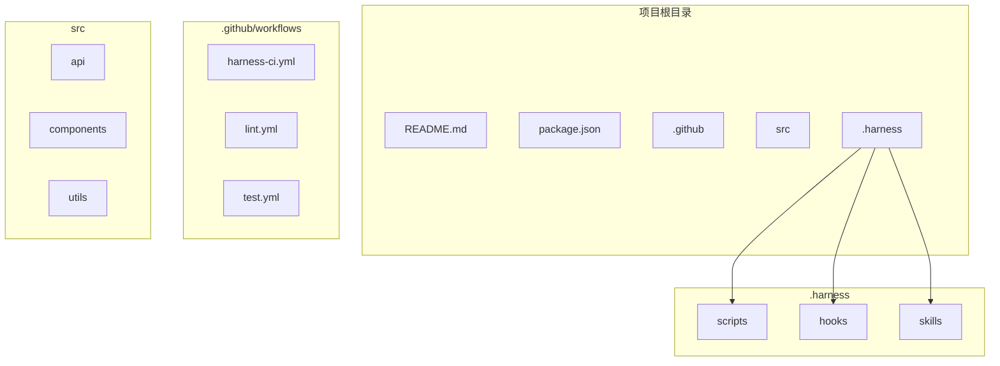

# Harness Designer

生成和修改定制化 Harness Engineering 系统。

## 触发条件

- 接收 harness-archaeology 的项目特征识别结果
- 基于项目模式生成定制化系统
- 将考古结果转化为可执行的脚本、Hook、Skill、工作流

## 核心职责（v3.0 重构）

```
输入: harness-archaeology 的项目特征识别结果
输出: 完整的定制化 Harness Engineering 系统

转换过程:
  项目特征 → 识别模式 → 生成脚本 → 配置 Hook → 封装 Skill → 编写工作流
```

## 四种模式

| 模式 | 输入 | 输出 |
|------|------|------|
| **From Inferred** | archaeology 推断结果 | 定制化系统 |
| **Greenfield** | 技术栈 + 项目描述 | 标准系统 |
| **Guided Discovery** | 项目类型 | 引导式生成 |
| **Brownfield** | 参考项目 Harness | 适配系统 |

### 模式 0：From Inferred（v3.0 核心模式）

适用：基于 harness-archaeology 的推断结果生成定制化系统。

#### Step 1：接收项目特征识别结果

从 harness-archaeology 接收项目特征识别结果：

```yaml
# 项目特征识别结果
project_features:
  project_name: my-api
  language: Python
  framework: FastAPI
  frontend: TypeScript + React
  
  # 识别的项目模式
  patterns:
    - API-Driven Development
    - 前后端分离
    - 通过 REST API 通信
    
  # 识别的关键目录
  directories:
    frontend_api: "src/api/"
    frontend_types: "src/types/api.ts"
    backend_api: "app/api/"
    
  # 质量工具
  tools:
    lint: ruff
    test: pytest
    type_check: mypy
```

#### Step 2：生成定制脚本

根据项目模式生成定制脚本：

```python
# .harness/scripts/check-api-sync.py
"""
API 同步检查脚本
自动生成，针对该项目的 API 同步需求
"""
import json
import sys
from pathlib import Path
from typing import Dict, List

class APISyncChecker:
    def __init__(self, project_root: str = "."):
        self.root = Path(project_root)
        self.frontend_api = self.root / "src/api"
        self.frontend_types = self.root / "src/types/api.ts"
        self.backend_api = self.root / "app/api"
    
    def check_type_sync(self) -> Dict:
        """检查前后端类型同步"""
        # 从 TypeScript 类型定义提取 API 契约
        # 从 Python 端点提取响应结构
        # 比较两者是否一致
        pass
    
    def check_endpoint_sync(self) -> Dict:
        """检查端点是否存在"""
        # 扫描前端 API 调用
        # 检查后端是否有对应端点
        pass
    
    def check_doc_sync(self) -> Dict:
        """检查文档是否需要更新"""
        # 检查 API 文档是否包含所有端点
        # 检查文档是否与代码一致
        pass
    
    def run_all_checks(self) -> Dict:
        """运行所有检查"""
        return {
            "type_sync": self.check_type_sync(),
            "endpoint_sync": self.check_endpoint_sync(),
            "doc_sync": self.check_doc_sync()
        }

def main():
    import argparse
    parser = argparse.ArgumentParser()
    parser.add_argument("--all", action="store_true")
    parser.add_argument("--type-sync", action="store_true")
    parser.add_argument("--endpoint-sync", action="store_true")
    parser.add_argument("--doc-sync", action="store_true")
    parser.add_argument("--changed", action="store_true")
    args = parser.parse_args()
    
    checker = APISyncChecker()
    
    if args.all or not any([args.type_sync, args.endpoint_sync, args.doc_sync]):
        result = checker.run_all_checks()
    else:
        result = {}
        if args.type_sync:
            result["type_sync"] = checker.check_type_sync()
        if args.endpoint_sync:
            result["endpoint_sync"] = checker.check_endpoint_sync()
        if args.doc_sync:
            result["doc_sync"] = checker.check_doc_sync()
    
    # 输出 JSON 结果
    print(json.dumps(result, indent=2))
    
    # 返回状态码
    has_error = any(
        v.get("status") == "error" 
        for v in result.values()
        if isinstance(v, dict)
    )
    sys.exit(1 if has_error else 0)

if __name__ == "__main__":
    main()
```

#### Step 3：配置自动化 Hook

生成 Hook 配置：

```yaml
# .harness/hooks/pre-commit
---
description: 提交前自动检查
version: 1.0.0
---

trigger:
  files_changed:
    - "src/api/**/*"
    - "src/types/api.ts"
    - "app/api/**/*"

checks:
  - name: api_sync
    command: "python .harness/scripts/check-api-sync.py --changed"
    on_failure: block
    condition: "has_api_changes"
```

#### Step 4：封装定制 Skill

生成 Skill 定义：

```markdown
---
name: api-sync-check
description: |
  API 同步检查 Skill。
  自动检查前后端 API 是否同步。
version: 1.0.0
tags: [api, sync, check]
---

# API Sync Check

## 触发条件

- 修改 `src/api/**/*.ts`
- 修改 `src/types/api.ts`
- 修改 `app/api/**/*.py`

## 执行

```bash
python .harness/scripts/check-api-sync.py --all
```

## 输出

```json
{
  "status": "ok|warn|error",
  "checks": {...},
  "recommendations": [...]
}
```
```

#### Step 5：编写定制工作流

生成工作流文档：

```markdown
# API 变更工作流

## 适用场景

- 新增 API 端点
- 修改 API 响应格式

## 流程

1. 更新后端 API
2. 更新前端类型
3. 更新 API 客户端
4. 运行 `check-api-sync.py`
5. 提交
```

#### Step 6：生成 Constitution 摘要

生成简化的 Constitution：

```markdown
# Constitution — my-api

## 项目特征

| 特征 | 值 |
|------|-----|
| 语言 | Python + TypeScript |
| 框架 | FastAPI + React |
| 模式 | API-Driven Development |

## 定制化输出

| 类型 | 文件 |
|------|------|
| 脚本 | check-api-sync.py |
| Hook | pre-commit |
| Skill | api-sync-check |
| 工作流 | api-change.md |
```

---

### 模式 1：Greenfield（技术栈已知）

适用：全新项目，技术选型已明确。

#### Step 1：交互式填写 Constitution

通过结构化问答生成 `constitution.md`，覆盖以下维度：

| 维度 | 必填问题 | 示例 |
|------|----------|------|
| 项目身份 | 项目名、描述、仓库地址 | payment-service |
| 技术栈 | 语言、框架、数据库、缓存 | Python 3.12 + FastAPI + PostgreSQL |
| 架构决策 | 单体/微服务、API 风格、认证方式 | REST + JWT |
| 安全约束 | 加密、PII 处理、注入防护 | bcrypt + parameterized queries |
| 质量门禁 | 覆盖率、类型检查、lint 规则 | coverage >= 85%, mypy strict |
| 工作流偏好 | 分支策略、commit 规范 | trunk-based + conventional commits |
| 环境信息 | 部署目标、CI/CD 平台 | K8s + GitHub Actions |
| Non-Goals | 明确排除的范围 | 不做 SSR、不做国际化 |

生成规则：
- 每个维度 1-3 个问题，最多 5 轮交互
- 用户可以跳过任意维度（使用默认值）
- Constitution 一旦确认，除非显式 `/harness-amend`，不可被 AI 单方面修改

#### Step 2：生成标准脚本

基于技术栈生成标准脚本：

```python
# .harness/scripts/check-quality.py
"""
质量检查脚本
基于项目技术栈自动生成
"""
import subprocess
import sys

def check_lint():
    """检查 lint"""
    result = subprocess.run(["ruff", "check", "."], capture_output=True, text=True)
    return result.returncode == 0

def check_type():
    """检查类型"""
    result = subprocess.run(["mypy", "app/"], capture_output=True, text=True)
    return result.returncode == 0

def check_test():
    """检查测试"""
    result = subprocess.run(["pytest", "tests/", "-v"], capture_output=True, text=True)
    return result.returncode == 0

def main():
    checks = {
        "lint": check_lint(),
        "type": check_type(),
        "test": check_test(),
    }
    
    all_passed = all(checks.values())
    
    for check, passed in checks.items():
        status = "✅" if passed else "❌"
        print(f"{status} {check}")
    
    sys.exit(0 if all_passed else 1)

if __name__ == "__main__":
    main()
```

#### Step 3：配置标准 Hook

```yaml
# .harness/hooks/pre-commit
---
description: 提交前质量检查
version: 1.0.0
---

checks:
  - name: lint
    command: "ruff check ."
    on_failure: warn
    
  - name: type
    command: "mypy app/"
    on_failure: warn
    
  - name: test
    command: "pytest tests/ -v"
    on_failure: block
```

#### Step 4：生成标准 Skill

```markdown
---
name: quality-check
description: |
  质量检查 Skill。
  运行 lint、类型检查、测试。
version: 1.0.0
tags: [quality, check, lint, test]
---

# Quality Check

## 触发条件

- 提交代码前
- 推送代码前
- CI/CD 流程

## 执行

```bash
python .harness/scripts/check-quality.py
```
```

---

### 模式 2：Guided Discovery（技术栈未知）

适用：项目类型已知，但技术选型未定。

流程：
1. 询问项目类型（Web API / Web App / CLI / Library / ...）
2. 根据类型推荐技术栈
3. 用户确认后进入 Greenfield 流程

---

### 模式 3：Brownfield（参考已有 Harness）

适用：参考已有 Harness 的项目创建新 Harness。

流程：
1. 读取参考项目的 `.agents/` 或 `.harness/`
2. 适配到新项目
3. 调整不符合新项目特征的部分

---

## CI/CD 集成（v3.1 新增）

生成的 Harness 系统包含完整的 CI 集成配置。

### GitHub Actions Workflow 生成

根据项目语言和框架，自动生成 GitHub Actions 配置：

```yaml
# .github/workflows/harness-ci.yml
name: Harness CI

on:
  push:
    branches: [main, develop, 'feature/*']
  pull_request:
    branches: [main]
  schedule:
    - cron: '0 2 * * *'  # 每天凌晨 2 点运行

jobs:
  lint:
    name: Lint
    runs-on: ${{ matrix.os }}
    strategy:
      matrix:
        os: [ubuntu-latest, macos-latest]
    steps:
      - uses: actions/checkout@v4
      - name: Setup
        run: |
          # 根据项目语言设置环境
          if [ -f package.json ]; then
            uses: actions/setup-node@v4
          elif [ -f pyproject.toml ]; then
            uses: astral-sh/setup-uv@v4
          elif [ -f go.mod ]; then
            uses: actions/setup-go@v5
          fi
      - run: npm ci && npm run lint
        if: exists('package.json')
      - run: uv sync && ruff check .
        if: exists('pyproject.toml')

  typecheck:
    name: Type Check
    runs-on: ubuntu-latest
    steps:
      - uses: actions/checkout@v4
      - run: npm run typecheck
        if: exists('package.json')
      - run: uv sync && mypy .
        if: exists('pyproject.toml')

  test:
    name: Test
    runs-on: ${{ matrix.os }}
    strategy:
      matrix:
        os: [ubuntu-latest, macos-latest]
      fail-fast: false
    steps:
      - uses: actions/checkout@v4
      - run: npm test -- --coverage
        if: exists('package.json')
      - run: uv sync && pytest --cov
        if: exists('pyproject.toml')

  security:
    name: Security Scan
    runs-on: ubuntu-latest
    steps:
      - uses: actions/checkout@v4
      - uses: aquasecurity/trivy-action@master
        with:
          scan-type: 'fs'
          severity: 'CRITICAL,HIGH'
          exit-code: '1'

  custom-checks:
    name: Custom Checks
    runs-on: ubuntu-latest
    steps:
      - uses: actions/checkout@v4
      - run: |
          # 运行定制检查脚本
          if [ -d .harness/scripts ]; then
            for script in .harness/scripts/check-*.py; do
              python "$script"
            done
          fi
```

### pre-commit 配置生成

根据项目语言生成 pre-commit 配置：

```yaml
# .pre-commit-config.yaml
repos:
  # 通用 hooks
  - repo: https://github.com/pre-commit/pre-commit-hooks
    rev: v4.5.0
    hooks:
      - id: trailing-whitespace
      - id: end-of-file-fixer
      - id: check-yaml
      - id: check-added-large-files
      - id: check-merge-conflict

  # Python 项目
  - repo: https://github.com/astral-sh/ruff-pre-commit
    rev: v0.3.0
    hooks:
      - id: ruff
        args: [check, --fix]
      - id: ruff-format
        args: [--check]
  - repo: https://github.com/pre-commit/mirrors-mypy
    rev: v1.8.0
    hooks:
      - id: mypy

  # TypeScript/JavaScript 项目
  - repo: https://github.com/pre-commit/mirrors-prettier
    rev: v3.2.0
    hooks:
      - id: prettier
        args: ['--check']
  - repo: https://github.com/typescript-eslint/typescript-eslint
    rev: v8.28.0
    hooks:
      - id: typecheck
        args: ['--no-error-on-unmatched-pattern']

  # Go 项目
  - repo: https://github.com/golangci/golangci-lint
    rev: v2.6.0
    hooks:
      - id: golangci-lint
        args: [run]
```

---

## 可视化展示（v3.1 新增）

### 项目结构可视化

生成 Mermaid 格式的项目结构图：



### 扫描结果摘要

```
📊 Harness 扫描结果
━━━━━━━━━━━━━━━━━━━━━━━━━━━━━━━━━━━━━━━━━━━━━

项目: my-fullstack-app
路径: /path/to/project
扫描时间: 2026-06-16 20:10:00

📋 项目信息
━━━━━━━━━━━━━━━━━━━━━━━━━━━━━━━━━━━━━━━━━━━━━
语言: Python (45%), TypeScript (45%), Go (10%)
框架: FastAPI + Next.js
包管理器: pip + pnpm

✅ 已检测到的工具
━━━━━━━━━━━━━━━━━━━━━━━━━━━━━━━━━━━━━━━━━━━━━
  • GitHub Actions CI (12 workflows)
  • pre-commit 配置
  • ruff linter
  • pytest 测试框架
  • mypy 类型检查

⚠️ 建议添加
━━━━━━━━━━━━━━━━━━━━━━━━━━━━━━━━━━━━━━━━━━━━━
  • typecheck 脚本
  • API 同步检查
  • 安全扫描配置

🎯 定制化系统
━━━━━━━━━━━━━━━━━━━━━━━━━━━━━━━━━━━━━━━━━━━━━
Scripts:
  • check-api-sync.py (API 同步检查)
  • check-db-migration.py (数据库迁移检查)

Hooks:
  • pre-commit (自动格式化)
  • pre-push (推送前验证)

CI Config:
  • .github/workflows/harness-ci.yml
  • .pre-commit-config.yaml

━━━━━━━━━━━━━━━━━━━━━━━━━━━━━━━━━━━━━━━━━━━━━
```

---

## 版本历史

- v3.1.0 (2026-06-16): CI/CD 集成、可视化展示
- v3.0.0 (2026-06-15): 重构为定制化系统输出
- v2.2.0 (2026-06-15): 增加四种模式
- v2.1.0: 初始版本

当检测到项目是 AI/LLM 相关项目时，自动添加以下定制脚本：

```python
# .harness/scripts/check-api-keys.py
"""
API Key 检查脚本
检查 AI API Key 是否正确配置
"""
import os
from pathlib import Path

def check_api_keys():
    """检查 API Key 环境变量"""
    required_keys = [
        "OPENAI_API_KEY",
        "ANTHROPIC_API_KEY",
    ]
    
    missing = []
    for key in required_keys:
        if not os.environ.get(key):
            # 检查 .env 文件
            env_file = Path(".env")
            if env_file.exists():
                with open(env_file) as f:
                    if key not in f.read():
                        missing.append(key)
            else:
                missing.append(key)
    
    return {
        "status": "ok" if not missing else "error",
        "missing_keys": missing
    }
```

---

## 版本历史

- v3.0.0 (2026-06-15): 重构为定制化系统输出，生成脚本/Hook/Skill/工作流
- v2.2.0 (2026-06-15): 增加 From Inferred 模式、AI/LLM 项目特殊处理
- v2.1.0: 初始版本
